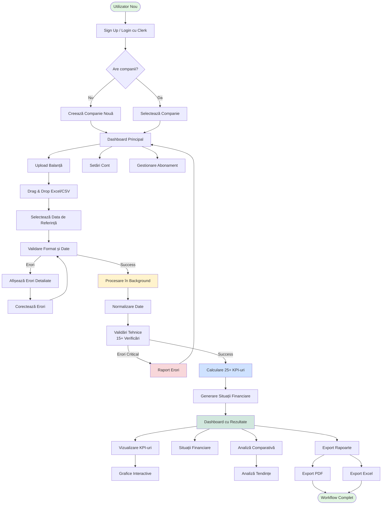
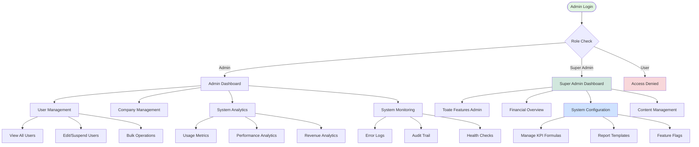
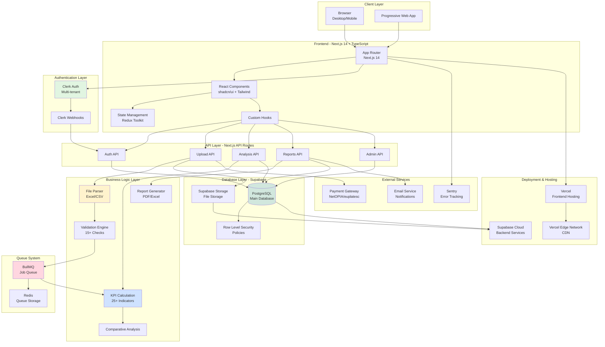
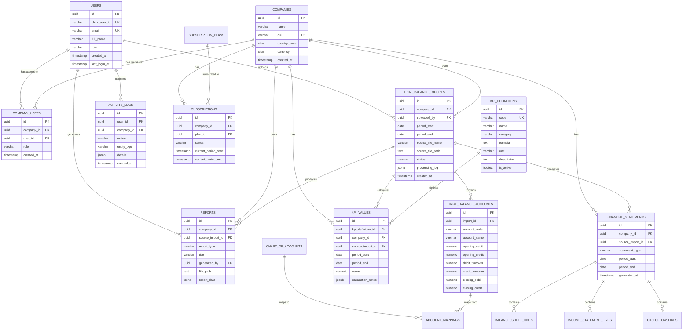
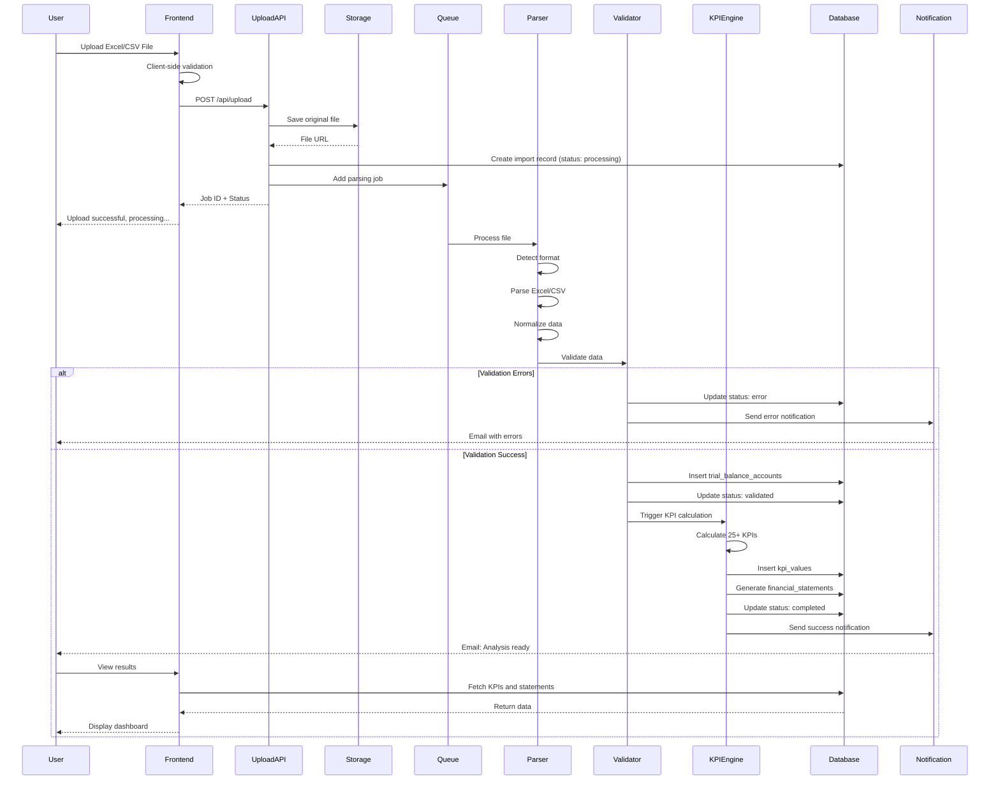
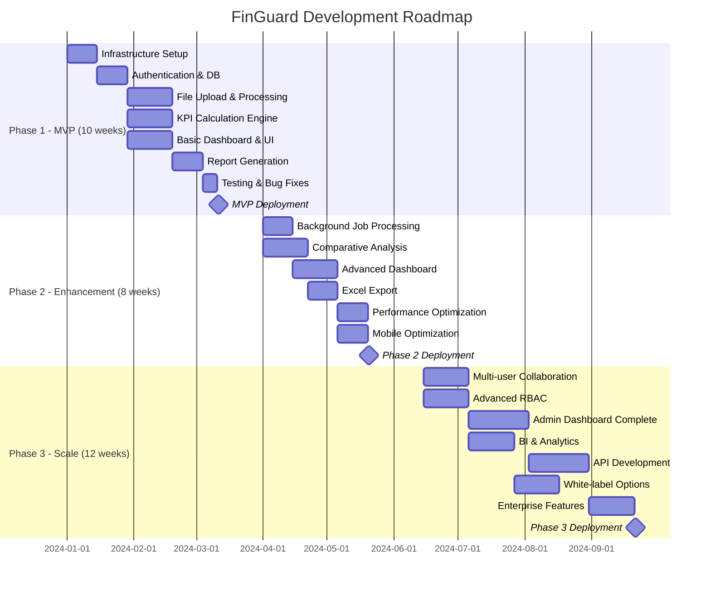
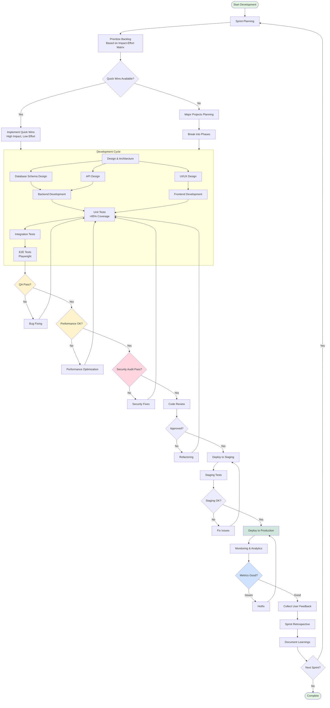
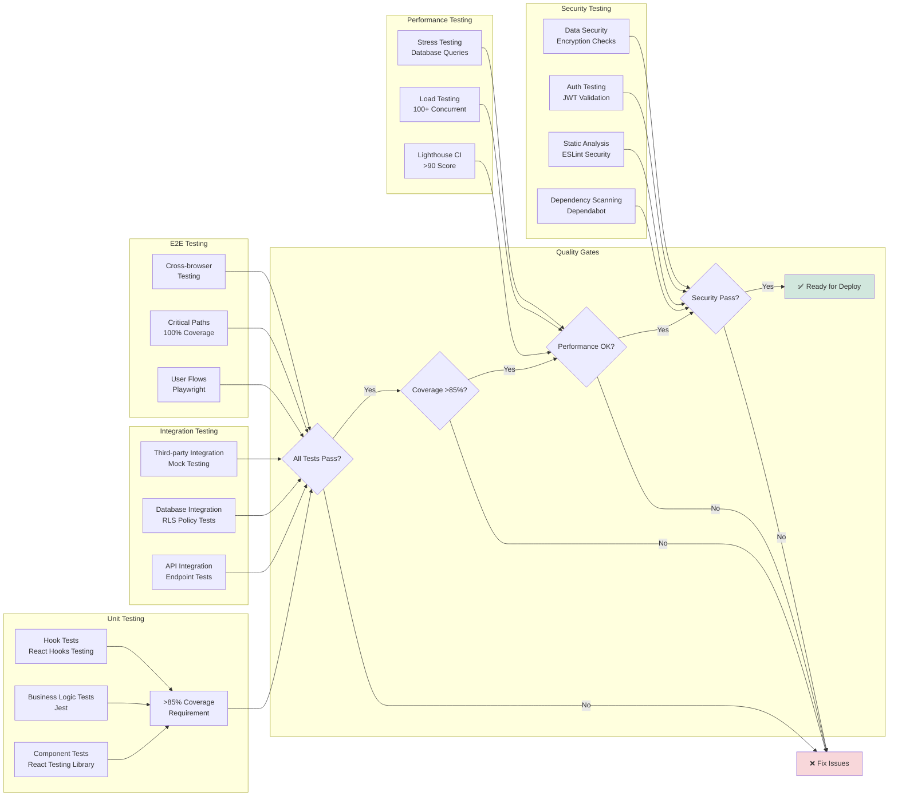
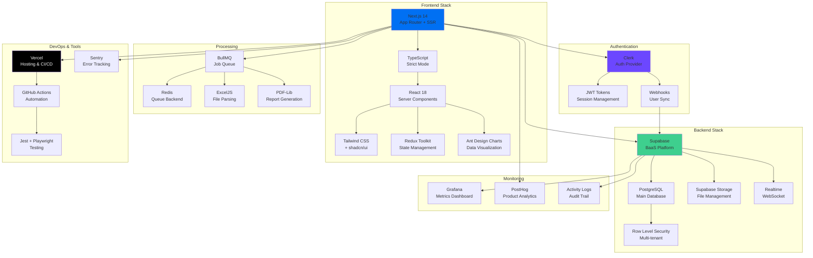

# Product Requirements Document - FinGuard

## Analiza Financiară Automată pentru Companiile Românești

---

## Mermaid Diagrams - System Overview & Development Approach

### 1. User Journey Flow - Fluxul Principal de Utilizare



### 2. Admin Dashboard Flow - Fluxul Administratorilor



### 3. System Architecture - Arhitectura Tehnică



### 4. Database Schema - Structura Bazei de Date



### 5. File Processing Pipeline - Pipeline de Procesare



### 6. Development Roadmap - Roadmap de Implementare



### 7. Development Approach - Abordarea de Dezvoltare



### 8. Task Priority Matrix - Impact vs Effort

```mermaid
quadrantChart
    title Task Prioritization Matrix
    x-axis Low Effort --> High Effort
    y-axis Low Impact --> High Impact
    quadrant-1 Major Projects
    quadrant-2 Quick Wins
    quadrant-3 Fill-In Tasks
    quadrant-4 Reconsider

    Authentication (Clerk): [0.25, 0.95]
    UI Components Setup: [0.30, 0.90]
    Dashboard Layout: [0.35, 0.85]
    Trial Balance Engine: [0.85, 0.95]
    KPI Calculation: [0.80, 0.95]
    Interactive Dashboard: [0.75, 0.90]
    Report Generation: [0.60, 0.85]
    File Upload UI: [0.65, 0.80]
    Background Jobs: [0.45, 0.60]
    Comparative Analysis: [0.55, 0.65]
    Landing Page: [0.40, 0.40]
    API Development: [0.70, 0.50]
    Multi-country Support: [0.90, 0.40]
    AI Predictions: [0.95, 0.45]
```

### 9. Testing Strategy Flow



### 10. Technology Stack Visualization



---

### 1. Executive Summary

**Provide a compelling business case overview:**

- **Primary Value Propositions:**

  - **Analiză financiară automată în 30 secunde** - Procesarea instantanee a balanțelor de verificare și generarea de rapoarte comprehensive
  - **Confidențialitate completă** - Nu necesită identificarea companiei prin CUI sau denumire, datele rămân anonime
  - **Preț competitiv** - Cost cu 80% mai mic decât consultanța financiară tradițională
  - **Accesibilitate 24/7** - Platforma cloud disponibilă de pe orice dispozitiv
  - **Validări automate inteligente** - Detectarea și raportarea automată a erorilor în balanțe

- **Strategic Alignment:** FinGuard se poziționează ca primul consultant financiar digital din România, digitalizând un proces tradițional care durează săptămâni și costă mii de euro

- **Core Benefits:**

  - Pentru utilizatori: Economie de timp (de la săptămâni la minute), acces instant la analize profesionale
  - Pentru organizație: Model SaaS scalabil, piață verticală neexploatată, recurring revenue model

- **Success Definition:** 1000+ utilizatori activi și 50.000+ analize procesate în primul an, cu ARR de 500.000 RON

---

### 2. Scope Definition

**Clearly define project boundaries:**

- **In Scope:**

  - **Sistem de autentificare multi-tenant** - Utilizatori multipli per companie cu roluri diferite
  - **Procesare automată balanțe Excel/CSV** - Upload, validare și normalizare automată
  - **Engine de analiză financiară** - Calculul a 25+ indicatori KPI standard
  - **Dashboard și raportare** - Interface vizual cu exporturi PDF/Excel
  - **Sistem de plăți și abonamente** - Integrat cu procesatori de plăți români
  - **Analize comparative temporale** - Evoluția indicatorilor pe luni/trimestre
  - **Validări automate tehnice** - Verificarea echilibrului și coerenței balanțelor

- **Out of Scope:**

  - Conectivitate directă cu ANAF sau alte sisteme externe
  - Funcționalități de contabilitate (nu concurăm cu software-ul de contabilitate)
  - Predicții AI complexe (rezervat pentru fazele viitoare)
  - Aplicație mobilă nativă (webapp responsive)
  - Suport pentru alte țări decât România

- **Future Considerations:**
  - AI-powered insights și predicții financiare
  - API pentru integrări cu software contabil românesc
  - Módulo de audit și conformitate
  - Extensie pentru alte piețe din Europa de Est

---

### 3. Target Market & User Analysis

**Define your ideal customers and users**

#### 3.1 Ideal Customer Profile (ICP)

- **Company Characteristics:**

  - **Dimensiune:** IMM-uri cu cifra de afaceri 100k-10M RON anual
  - **Industrie:** Servicii, comerț, producție light, consultanță
  - **Locație geografică:** România (inițial), cu focalizare pe București, Cluj, Timișoara, Iași
  - **Maturitate organizațională:** Companii cu 2-50 angajați care au depășit faza de startup

- **Technology Profile:**

  - Utilizează Excel pentru gestiunea financiară
  - Software de contabilitate basic (Saga, WizSoft, FirstSoft)
  - Comfort mediu cu SaaS solutions
  - Nu au resurse pentru consultant financiar full-time

- **Business Context:**

  - **Pain points:** Analize financiare realizate manual, consultanță costisitoare și lentă
  - **Soluții actuale:** Excel manual, consultanți ocasionali costisitori
  - **Buget:** 100-1000 RON/lună pentru instrumente de analiză financiară
  - **Proces decizie:** Manager/proprietar cu decizie directă (sales cycle 1-4 săptămâni)

- **Success Criteria:** Reducerea timpului de analiză de la 4-8 ore la 15 minute, identificarea rapidă a tendințelor negative

#### 3.2 User Personas (4 Primary Types)

**Persona 1: Antreprenorul Pragmatic**

- **Demographics & Role:** CEO/Owner, 35-50 ani, 5-15 ani experiență business
- **Goals & Motivations:** Control și vizibilitate asupra sănătății financiare, deciții informate rapid
- **Pain Points:** Timp limitat, costuri mari consultanță, dependență de contabil pentru analize
- **Technical Proficiency:** Excel avansat, confortabil cu aplicații web
- **Usage Patterns:** Analize lunare după closing, verificări ad-hoc înainte de investiții
- **Decision Influence:** Decizie finală de achiziție și implementare

**Persona 2: Contabilul Progresist**

- **Demographics & Role:** Contabil șef/Manager financiar, 28-45 ani, experiență 5-12 ani
- **Goals & Motivations:** Eficientizarea proceselor, oferirea de analize value-added către clienți
- **Pain Points:** Procese manuale repetitive, presiune pentru deliverables quick
- **Technical Proficiency:** Expert Excel, familiar cu software-ul contabil, adoptant early SaaS
- **Usage Patterns:** Utilizare zilnică pentru clienți multipli, procesare batch
- **Decision Influence:** Recomandă soluția, influențează implementarea

**Persona 3: Analystul Financiar din IFN**

- **Demographics & Role:** Credit analyst, 25-35 ani, background financiar formal
- **Goals & Motivations:** Evaluări rapide și precise pentru aprobare credite, risk assessment
- **Pain Points:** Volume mari de dosare, presiune timp, nevoia de standardizare
- **Technical Proficiency:** Foarte înalt, familiar cu instrumentele financiare
- **Usage Patterns:** Analize multiple zilnic, focus pe indicatori de risc
- **Decision Influence:** Utilizator final, prescriptor pentru departament

**Persona 4: Managerul Financiar Corporate**

- **Demographics & Role:** CFO/Finance Manager în companii medii, 35-50 ani
- **Goals & Motivations:** Monitorizare performance subsidiare, raportare către board
- **Pain Points:** Consolidare informații din surse multiple, raportare în timp real
- **Technical Proficiency:** Înalt, experiență cu ERP și BI tools
- **Usage Patterns:** Analize comparative între entități, trending analysis
- **Decision Influence:** Budget owner, implementare la nivel organizațional

---

### 4. User Stories & Acceptance Criteria

**For each persona, define specific user scenarios:**

#### 4.1 Core User Stories

**US001 - Antreprenorul Pragmatic:**
"Ca proprietar de IMM, vreau să încarc balanta lunară și să obțin instant o analiză completă a situației financiare, astfel încât să pot lua decizii informate fără să plătesc consultanți scumpi."

**US002 - Contabilul Progresist:**
"Ca contabil pentru IMM-uri, vreau să procesez rapid balanțele clienților și să generez rapoarte profesionale cu indicatori cheie, astfel încât să pot oferi servicii cu valoare adăugată."

**US003 - Analystul IFN:**
"Ca analist de credit, vreau să evaluez rapid sănătatea financiară a unei companii prin încărcarea balanței, astfel încât să accelerez procesul de aprobare credite."

**US004 - Managerul Financiar:**
"Ca CFO, vreau să compar performanța financiară pe mai multe perioade și să identific tendințele, astfel încât să pot raporta boardului și să iau măsuri preventive."

**US005 - Administratorul Aplicației:**
"Ca administrator al aplicației FinGuard, vreau să monitorizez utilizarea platformei, să gestionez utilizatorii și să analizez performanța sistemului, astfel încât să asigur funcționarea optimă și să iau decizii informate pentru dezvoltare."

**US006 - Super Admin:**
"Ca super administrator, vreau să am acces complet la toate datele din platformă, să pot genera rapoarte de business intelligence și să gestionez abonamentele utilizatorilor, astfel încât să pot optimiza performanța business-ului."

#### 4.2 Detailed User Flows

**Primary Workflow 1: Analiza Financiară de Bază**

1. **Autentificare:** Login cu email/password prin Clerk
2. **Selecție companie:** Selectare/adăugare companie pentru analiză
3. **Upload balanță:** Drag & drop fișier Excel cu validare format
4. **Selecție dată referință:** Obligatoriu - luna/anul pentru balanță
5. **Procesare automată:** Validări tehnice în background (30 secunde)
6. **Rezultate:** Dashboard cu indicatori cheie și status validare
7. **Export:** PDF profesional sau Excel pentru arhivare

**Primary Workflow 2: Analiză Comparativă**

1. **Selecție companie:** Din companiile existente
2. **Selecție perioade:** Min 2 luni pentru comparație
3. **Generare trends:** Calcul automat evoluție indicatori
4. **Vizualizare:** Charts interactive cu trend analysis
5. **Alerting:** Notificare pentru indicatori în declin
6. **Export:** Raport comparativ PDF cu recomandări

**Primary Workflow 3: Dashboard Administrator**

1. **Autentificare Admin:** Login cu roluri de admin/super_admin
2. **Overview Dashboard:** Statistici generale - utilizatori activi, încărcări, revenue
3. **Gestionare Utilizatori:** Vizualizare, editare, suspendare conturi utilizatori
4. **Monitorizare Sistem:** Performance metrics, error logs, usage analytics
5. **Gestionare Abonamente:** Status plăți, upgrade/downgrade planuri
6. **Rapoarte Business:** Export statistici pentru analiză business
7. **Configurare Sistem:** Setări aplicație, management KPI definitions

**Primary Workflow 4: Super Admin Operations**

1. **Company Management:** Vizualizare toate companiile, merge/split operațiuni
2. **Financial Overview:** Revenue analytics, subscription trends, churn analysis
3. **System Health:** Infrastructure monitoring, database performance, security alerts
4. **Content Management:** Management KPI formulas, report templates, system messaging
5. **User Support:** Access la toate datele pentru support tehnic nivel 3

**Success Scenarios:**

- Upload și procesare sub 60 secunde pentru balanțe <1000 linii
- Zero erori pentru balanțe validate tehnic corect
- Dashboard responsive pe mobile/tablet/desktop
- Export PDF formatat professional în <10 secunde

**Edge Cases:**

- **Balanță neechilibrată:** Mesaj clar cu erori specifice, sugestii corecție
- **Format necunoscut:** Auto-detectare și normalizare sau reject cu explicații
- **Date duplicate:** Verificare și alertă pentru încărcări pe aceeași perioadă
- **Fișiere mari:** Progress bar și procesare în background cu notificare

**Acceptance Criteria:**

- ✅ 95% din balanțele standard române procesate fără intervenție manuală
- ✅ Timp procesare <2 minute pentru balanțe cu <2000 linii
- ✅ Raportare 100% precisă a erorilor de echilibru
- ✅ Zero data loss - toate încărcările arhivate complet

---

### 5. Feature Specifications

#### 5.1 Feature Hierarchy

**F001 - Sistemul de Autentificare Multi-tenant**

- **Feature Overview:** Gestionarea utilizatorilor, companiilor și rolurilor cu securitate enterprise
- **Priority:** Critical - Fundația aplicației
- **Complexity:** Moderate - Integrare Clerk cu logică business custom
- **User Value Score:** 9/10 - Esențial pentru utilizare

**F002 - Engine de Upload și Normalizare Balanțe**

- **Feature Overview:** Acceptă orice format de balanță româna și o convertește în standard DB
- **Priority:** Critical - Core functionality
- **Complexity:** Very Complex - Parsare Excel variată, validări complexe
- **User Value Score:** 10/10 - Funcționalitatea primară

**F003 - Sistemul de Validări Automate**

- **Feature Overview:** 15+ verificări tehnice pentru corectitudine balanță
- **Priority:** Critical - Diferențiator competitiv
- **Complexity:** Complex - Logică financiar-contabilă precisă
- **User Value Score:** 9/10 - Previne erori costisitoare

**F004 - Dashboard și Indicatori KPI**

- **Feature Overview:** 25+ indicatori standard cu visualizări interactive
- **Priority:** High - Value proposition principal
- **Complexity:** Moderate - Calcule matematice + UI/UX
- **User Value Score:** 10/10 - Rezultatul final pentru utilizator

**F005 - Sistemul de Export Rapoarte**

- **Feature Overview:** Generare PDF/Excel profesional cu branding
- **Priority:** High - Necesitate business
- **Complexity:** Moderate - Templates + generare fișiere
- **User Value Score:** 8/10 - Important pentru workflow-ul utilizatorilor

**F006 - Analize Comparative și Trending**

- **Feature Overview:** Comparații inter-periode cu identificare tendințe
- **Priority:** Medium - Advanced feature pentru retenție
- **Complexity:** Moderate - Algoritmi comparativi + vizualizări
- **User Value Score:** 8/10 - Funcționalitate diferențiatoare

**F007 - Sistem de Plăți și Abonamente**

- **Feature Overview:** Billing automat cu procesatori români (NetOPIA, euplatesc)
- **Priority:** High - Revenue generation
- **Complexity:** Moderate - Integrări terțe + billing logic
- **User Value Score:** 7/10 - Necesitate operațională

**F008 - Dashboard Administrator Complet**

- **Feature Overview:** Interface de administrare cu analytics, user management și system monitoring
- **Priority:** High - Operațiuni business critice
- **Complexity:** Complex - Multiple integrări, dashboard complex, role management
- **User Value Score:** 8/10 - Esențial pentru operațiuni și growth

**F009 - Sistema de Roluri și Permisiuni Avansate**

- **Feature Overview:** Role-based access control cu granularitate fină pentru toate funcționalitățile
- **Priority:** High - Securitate și compliance
- **Complexity:** Complex - Multi-tenant permissions, audit trails, security layers
- **User Value Score:** 9/10 - Critic pentru scaling și security

#### 5.2 Detailed Requirements

**F002 - Engine de Upload și Normalizare Balanțe**

**Functional Specifications:**

- Acceptă fișiere Excel (.xlsx, .xls) și CSV până la 10MB
- Auto-detectare format balanță (4 egalități, 5 egalități, custom)
- Normalizare automată la structura DB standard cu 8 coloane
- Validare integritate fișier (nu este corupt, format valid)
- Mappare dinamică coloane indiferent de ordinea din fișier
- Validare date: numerice pozitive/negative, format conturi contabile
- Handling pentru celule merged, formule Excel, formatări speciale

**User Interface Requirements:**

- Drag & drop area cu progress indicator
- Preview primele 10 linii după upload pentru confirmare
- Selector dată obligatoriu cu calendar widget
- Error reporting clar cu indicarea liniei și tipului de problemă
- Progress bar pentru procesare cu estimare timp
- Mobile-responsive pentru tablet usage în deplasare

**Data Requirements:**

- Input: Excel/CSV cu coloanele standard de balanță românească
- Validare: toate câmpurile numerice, format cont XX sau XXX.XX
- Output: structură normalizată în `trial_balance_accounts` cu 8 coloane standard
- Storage: fișier original păstrat pentru audit + date normalizate pentru procesare
- Versioning: multiple încărcări pentru aceeași perioadă cu override întrebare

**Business Rules:**

- O balanță per companie per lună - override cu confirmare utilizator
- Validare echilibru: Total debite = Total credite (diferență max 1 RON)
- Conturi obligatorii: trebuie să conțină cel puțin conturile din clasele 1-7
- Date valide: perioada nu poate fi în viitor cu >1 lună
- Format conturi: doar numerice sau cu punct (401.01 valid)

**Integration Points:**

- Database: inserare în `trial_balance_imports` și `trial_balance_accounts`
- File Storage: S3/Supabase Storage pentru păstrare fișiere originale
- Queue System: BullMQ pentru procesare asyncronă balanțe mari
- Notification: email/in-app când procesarea este completă

**Performance Requirements:**

- Upload: completion în <30 secunde pentru fișiere <5MB
- Processing: <2 minute pentru balanțe cu <2000 linii de cont
- Concurrent: suport pentru 10 upload-uri simultane fără degradare
- Error Recovery: retry automat pentru network issues, partial success handling

**F008 - Dashboard Administrator Complet**

**Functional Specifications:**

- **User Management Dashboard:**
  - Tabel cu toți utilizatorii: email, nume, rol, status, last_login, created_at
  - Filtere și căutare: după rol, status, perioada înregistrării
  - Acțiuni bulk: suspendare/activare multiplă, export utilizatori
  - Drill-down pentru fiecare utilizator: activitate detaliată, companii asociate
- **System Analytics Dashboard:**

  - **Usage Metrics:** Utilizatori activi zilnic/lunar, session duration, bounce rate
  - **File Processing Stats:** Succesuri/eșecuri upload, tipuri de fișiere procesate, volume
  - **Performance Monitoring:** Response times pentru API-uri critice, uptime, error rates
  - **Financial Metrics:** Revenue lunar, conversion rates, churn analysis, ARPU

- **Company Management Interface:**

  - Overview toate companiile din sistem cu statistici de utilizare
  - Company details: număr utilizatori, volume procesate, status abonament
  - Merge/split capabilities pentru companii duplicate
  - Audit trail pentru toate modificările efectuate

- **System Configuration Panel:**
  - Management KPI definitions: add/edit/disable formule
  - Report templates management: customizare template-uri PDF/Excel
  - System messaging: maintenance notifications, feature announcements
  - Feature flags management pentru A/B testing

**User Interface Requirements:**

- **Responsive Admin Dashboard:** Optimizat pentru desktop primary, suport tablet
- **Real-time Updates:** WebSocket connections pentru live metrics și notifications
- **Interactive Charts:** Drill-down capabilities, export charts, custom date ranges
- **Bulk Operations UI:** Checkbox selection, progress indicators pentru operațiuni batch
- **Advanced Filtering:** Multiple criteria, saved filters, quick filters pentru acțiuni comune
- **Dark/Light Theme:** Consistent cu aplicația principală

**Data Requirements:**

- **Input Sources:**

  - activity_logs table pentru user behavior analytics
  - trial_balance_imports pentru processing statistics
  - subscriptions pentru revenue metrics
  - system logs pentru performance monitoring

- **Aggregated Data Tables:**

  - daily_usage_stats: pre-calculat pentru performance
  - monthly_revenue_summary: cached pentru rapid access
  - user_activity_summary: updated real-time pentru active sessions

- **Export Capabilities:**
  - CSV export pentru toate tabelele cu date
  - PDF reports pentru executive summaries
  - Excel dashboards cu charts pentru prezentări business

**Business Rules:**

- **Access Control:** Doar utilizatori cu rol 'admin' sau 'super_admin' pot accesa
- **Data Retention:** Logs păstrate 2 ani, analytics data arhivată după 5 ani
- **Audit Requirements:** Toate acțiunile admin loggate cu user_id, timestamp, action details
- **Performance SLA:** Dashboard load time <3 secunde, real-time updates <1 secundă lag
- **Data Privacy:** Respectarea GDPR pentru export-uri cu date personale

**Integration Points:**

- **Monitoring Integration:** Sentry pentru error tracking, Grafana pentru metrics
- **Email Service:** Notificări automate pentru events critice (system down, high error rate)
- **Analytics Service:** Integration cu PostHog/Mixpanel pentru advanced user behavior
- **Backup Systems:** Automated daily backups cu retention policy

**Performance Requirements:**

- **Dashboard Loading:** <3 secunde pentru load inițial cu cache
- **Real-time Updates:** <1 secundă delay pentru live metrics
- **Bulk Operations:** Support pentru 1000+ records simultaneous selection
- **Concurrent Admin Users:** Support pentru 5+ admini simultaneous fără degradare
- **Data Refresh:** Cached data refresh la 5 minute pentru non-critical metrics

---

### 6. Technical Architecture & Implementation

#### 6.1 Technology Stack & Architecture Decision

**Recommend and justify technology choices:**

**Frontend Framework: Next.js 14 cu TypeScript**

- **Rationale:** SSR pentru SEO, file-system based routing, optimizări de performanță built-in
- **Benefits:** Development velocity înalt, ecosystem matur, deploy ușor Vercel
- **Alternatives considered:** SPA React (reject - SEO important pentru acquisitie), Vue.js (reject - ecosystem mai mic)

**Backend Solution: Supabase (PostgreSQL + Auth + Storage + Real-time)**

- **Rationale:** Managed PostgreSQL cu RLS, auth built-in, reducere complexity infrastructură
- **Benefits:** Time-to-market rapid, scaling automat, backup și recovery managed
- **Alternatives considered:** Custom Express API (reject - overhead infrastructură), Firebase (reject - vendor lock-in Google)

**Database: PostgreSQL cu Row Level Security**

- **Rationale:** ACID compliance pentru date financiare, JSON support pentru flexibilitate
- **Benefits:** Data integrity garantată, scaling vertical/horizontal, ecosystem bogat
- **Alternatives considered:** MySQL (reject - JSON support mai slab), NoSQL (reject - nu potrivit pentru date financiare)

**Authentication: Clerk**

- **Rationale:** Multi-tenant ready, social login, enterprise features fără custom development
- **Benefits:** User management UI, audit logs, compliance built-in
- **Alternatives considered:** Supabase Auth (reject - mai puține features enterprise), Custom Auth (reject - security complexity)

**Hosting & Infrastructure:**

- **Frontend:** Vercel pentru Next.js optimization
- **Backend:** Supabase cloud cu replicare multi-region
- **CDN:** Vercel Edge Network pentru assets
- **Monitoring:** Supabase dashboard + Sentry pentru errors

**Development Tools:**

- **Build:** Next.js built-in bundling cu turbopack
- **Testing:** Jest + React Testing Library + Playwright E2E
- **Code Quality:** ESLint + Prettier + TypeScript strict mode
- **CI/CD:** GitHub Actions cu deploy automat la push

#### 6.2 Application Scaffolding & Structure

**CREATE COMPLETE APPLICATION SCAFFOLDING IN THIS SECTION **

```
finguard/
├── README.md
├── package.json
├── next.config.js
├── tailwind.config.js
├── tsconfig.json
├── .eslintrc.json
├── playwright.config.ts
├── .env.local.example
├── public/
│   ├── icons/
│   │   ├── icon-192.png
│   │   └── icon-512.png
│   ├── images/
│   │   ├── logo.svg
│   │   ├── hero-bg.jpg
│   │   └── testimonials/
│   └── favicon.ico
├── src/
│   ├── app/                    # Next.js 13+ App Router
│   │   ├── globals.css
│   │   ├── layout.tsx
│   │   ├── page.tsx           # Landing page
│   │   ├── loading.tsx
│   │   ├── error.tsx
│   │   ├── not-found.tsx
│   │   ├── (auth)/            # Route groups
│   │   │   ├── sign-in/
│   │   │   │   └── [[...sign-in]]/
│   │   │   │       └── page.tsx
│   │   │   └── sign-up/
│   │   │       └── [[...sign-up]]/
│   │   │           └── page.tsx
│   │   ├── dashboard/         # Protected routes
│   │   │   ├── layout.tsx     # Dashboard layout with sidebar
│   │   │   ├── page.tsx       # Main dashboard
│   │   │   ├── upload/
│   │   │   │   └── page.tsx   # Balance upload
│   │   │   ├── reports/
│   │   │   │   ├── page.tsx   # Reports list
│   │   │   │   └── [id]/
│   │   │   │       └── page.tsx
│   │   │   ├── indicators/
│   │   │   │   └── page.tsx   # KPI dashboard
│   │   │   ├── analysis/
│   │   │   │   ├── page.tsx   # Financial analysis
│   │   │   │   └── comparative/
│   │   │   │       └── page.tsx
│   │   │   ├── forecasting/
│   │   │   │   └── page.tsx   # Budget forecasting
│   │   │   └── settings/
│   │   │       ├── page.tsx   # Account settings
│   │   │       └── billing/
│   │   │           └── page.tsx
│   │   ├── admin/            # Admin only routes
│   │   │   ├── layout.tsx    # Admin layout with navigation
│   │   │   ├── page.tsx      # Admin dashboard overview
│   │   │   ├── users/
│   │   │   │   ├── page.tsx  # User management
│   │   │   │   └── [id]/
│   │   │   │       └── page.tsx # User details
│   │   │   ├── companies/
│   │   │   │   ├── page.tsx  # Company management
│   │   │   │   └── [id]/
│   │   │   │       └── page.tsx # Company details
│   │   │   ├── analytics/
│   │   │   │   ├── page.tsx  # System analytics
│   │   │   │   ├── usage/
│   │   │   │   │   └── page.tsx
│   │   │   │   └── revenue/
│   │   │   │       └── page.tsx
│   │   │   ├── subscriptions/
│   │   │   │   └── page.tsx  # Subscription management
│   │   │   ├── system/
│   │   │   │   ├── page.tsx  # System configuration
│   │   │   │   ├── kpis/
│   │   │   │   │   └── page.tsx # KPI management
│   │   │   │   └── templates/
│   │   │   │       └── page.tsx # Template management
│   │   │   └── logs/
│   │   │       ├── page.tsx  # Activity logs
│   │   │       ├── errors/
│   │   │       │   └── page.tsx
│   │   │       └── audit/
│   │   │           └── page.tsx
│   │   └── api/              # API routes
│   │       ├── webhook/
│   │       │   └── clerk/
│   │       │       └── route.ts
│   │       ├── upload/
│   │       │   └── route.ts
│   │       ├── reports/
│   │       │   ├── route.ts
│   │       │   └── [id]/
│   │       │       └── route.ts
│   │       └── indicators/
│   │           └── route.ts
│   ├── components/
│   │   ├── ui/               # shadcn/ui components
│   │   │   ├── button.tsx
│   │   │   ├── input.tsx
│   │   │   ├── card.tsx
│   │   │   ├── dialog.tsx
│   │   │   ├── dropdown-menu.tsx
│   │   │   ├── progress.tsx
│   │   │   ├── select.tsx
│   │   │   ├── table.tsx
│   │   │   ├── tabs.tsx
│   │   │   └── toast.tsx
│   │   ├── layout/
│   │   │   ├── header.tsx
│   │   │   ├── sidebar.tsx
│   │   │   ├── footer.tsx
│   │   │   └── navigation.tsx
│   │   ├── forms/
│   │   │   ├── upload-balance-form.tsx
│   │   │   ├── company-form.tsx
│   │   │   └── settings-form.tsx
│   │   ├── dashboard/
│   │   │   ├── stats-cards.tsx
│   │   │   ├── recent-activity.tsx
│   │   │   ├── kpi-grid.tsx
│   │   │   └── chart-components.tsx
│   │   ├── reports/
│   │   │   ├── report-list.tsx
│   │   │   ├── report-viewer.tsx
│   │   │   └── export-options.tsx
│   │   ├── upload/
│   │   │   ├── file-dropzone.tsx
│   │   │   ├── upload-progress.tsx
│   │   │   ├── validation-results.tsx
│   │   │   └── date-selector.tsx
│   │   └── common/
│   │       ├── loading-spinner.tsx
│   │       ├── error-boundary.tsx
│   │       ├── pagination.tsx
│   │       └── theme-toggle.tsx
│   ├── lib/
│   │   ├── supabase/
│   │   │   ├── client.ts      # Browser client
│   │   │   ├── server.ts      # Server client
│   │   │   └── middleware.ts  # Auth middleware
│   │   ├── auth/
│   │   │   ├── clerk.ts       # Clerk configuration
│   │   │   └── permissions.ts # Role-based access
│   │   ├── utils/
│   │   │   ├── cn.ts         # Class name utility
│   │   │   ├── formatters.ts # Number/date formatting
│   │   │   ├── validators.ts # Form validation
│   │   │   └── constants.ts  # App constants
│   │   ├── calculations/
│   │   │   ├── kpi-engine.ts # KPI calculation logic
│   │   │   ├── validators.ts # Balance validations
│   │   │   └── formatters.ts # Balance normalization
│   │   └── integrations/
│   │       ├── file-parser.ts # Excel/CSV parsing
│   │       ├── pdf-generator.ts
│   │       └── excel-exporter.ts
│   ├── hooks/
│   │   ├── use-upload.ts     # File upload logic
│   │   ├── use-companies.ts  # Company management
│   │   ├── use-reports.ts    # Reports data
│   │   ├── use-indicators.ts # KPI data
│   │   └── use-local-storage.ts
│   ├── store/               # Redux Toolkit
│   │   ├── index.ts
│   │   ├── auth-slice.ts
│   │   ├── companies-slice.ts
│   │   ├── reports-slice.ts
│   │   └── ui-slice.ts
│   ├── types/
│   │   ├── database.ts      # Supabase generated types
│   │   ├── auth.ts          # Clerk types
│   │   ├── api.ts           # API response types
│   │   ├── balance.ts       # Balance structure types
│   │   └── reports.ts       # Report types
│   └── styles/
│       ├── globals.css      # Global styles + Tailwind
│       └── components.css   # Component-specific styles
├── database/
│   ├── schema.sql          # Complete database schema
│   ├── migrations/
│   │   ├── 001_initial_schema.sql
│   │   ├── 002_add_kpi_definitions.sql
│   │   └── 003_add_audit_logs.sql
│   ├── seed/
│   │   ├── kpi_definitions.sql
│   │   ├── chart_of_accounts.sql
│   │   └── sample_data.sql
│   └── policies/           # Row Level Security
│       ├── users_policies.sql
│       ├── companies_policies.sql
│       └── reports_policies.sql
├── tests/
│   ├── __mocks__/
│   ├── components/
│   ├── pages/
│   ├── utils/
│   └── e2e/               # Playwright tests
│       ├── auth.spec.ts
│       ├── upload.spec.ts
│       └── dashboard.spec.ts
├── docs/
│   ├── API.md
│   ├── deployment.md
│   ├── database-schema.md
│   └── user-guide.md
└── scripts/
    ├── setup-db.ts       # Database setup
    ├── seed-data.ts      # Seed sample data
    └── generate-types.ts # Type generation
```

#### 6.3 Database Schema Design

**CREATE COMPLETE DATABASE SCHEMA IN THIS SECTION:**

```sql
-- Enable necessary extensions
CREATE EXTENSION IF NOT EXISTS "uuid-ossp";
CREATE EXTENSION IF NOT EXISTS "pgcrypto";

-- =====================================================
-- 1. AUTHENTICATION & IDENTITY
-- =====================================================

-- Users table (synced with Clerk)
CREATE TABLE users (
    id UUID PRIMARY KEY DEFAULT gen_random_uuid(),
    clerk_user_id VARCHAR(255) UNIQUE NOT NULL,
    email VARCHAR(255) UNIQUE NOT NULL,
    full_name VARCHAR(255) NOT NULL,
    role VARCHAR(50) DEFAULT 'user' CHECK (role IN ('user', 'admin', 'super_admin')),
    created_at TIMESTAMP WITH TIME ZONE DEFAULT NOW(),
    updated_at TIMESTAMP WITH TIME ZONE DEFAULT NOW(),
    last_login_at TIMESTAMP WITH TIME ZONE
);

-- Companies table
CREATE TABLE companies (
    id UUID PRIMARY KEY DEFAULT gen_random_uuid(),
    name VARCHAR(255) NOT NULL,
    cui VARCHAR(20) UNIQUE, -- Optional for confidentiality
    country_code CHAR(2) DEFAULT 'RO',
    currency CHAR(3) DEFAULT 'RON',
    fiscal_year_start_month INTEGER DEFAULT 1 CHECK (fiscal_year_start_month BETWEEN 1 AND 12),
    created_by UUID REFERENCES users(id),
    created_at TIMESTAMP WITH TIME ZONE DEFAULT NOW(),
    updated_at TIMESTAMP WITH TIME ZONE DEFAULT NOW()
);

-- Many-to-many relationship: users can access multiple companies
CREATE TABLE company_users (
    id UUID PRIMARY KEY DEFAULT gen_random_uuid(),
    company_id UUID NOT NULL REFERENCES companies(id) ON DELETE CASCADE,
    user_id UUID NOT NULL REFERENCES users(id) ON DELETE CASCADE,
    role VARCHAR(50) DEFAULT 'member' CHECK (role IN ('owner', 'admin', 'member', 'viewer')),
    created_at TIMESTAMP WITH TIME ZONE DEFAULT NOW(),
    UNIQUE(company_id, user_id)
);

-- =====================================================
-- 2. CHART OF ACCOUNTS & MAPPINGS
-- =====================================================

-- Standard chart of accounts (Romanian accounting)
CREATE TABLE chart_of_accounts (
    id UUID PRIMARY KEY DEFAULT gen_random_uuid(),
    account_code VARCHAR(20) NOT NULL,
    account_name VARCHAR(255) NOT NULL,
    account_type VARCHAR(50) NOT NULL CHECK (
        account_type IN ('asset', 'liability', 'equity', 'revenue', 'expense')
    ),
    account_class INTEGER CHECK (account_class BETWEEN 1 AND 8),
    is_synthetic BOOLEAN DEFAULT false,
    parent_account_id UUID REFERENCES chart_of_accounts(id),
    company_id UUID REFERENCES companies(id), -- NULL for global template
    created_at TIMESTAMP WITH TIME ZONE DEFAULT NOW(),
    UNIQUE(account_code, company_id)
);

-- =====================================================
-- 3. TRIAL BALANCE IMPORTS
-- =====================================================

-- Trial balance import sessions
CREATE TABLE trial_balance_imports (
    id UUID PRIMARY KEY DEFAULT gen_random_uuid(),
    company_id UUID NOT NULL REFERENCES companies(id) ON DELETE CASCADE,
    uploaded_by UUID NOT NULL REFERENCES users(id),
    period_start DATE NOT NULL,
    period_end DATE NOT NULL,
    source_file_name VARCHAR(255) NOT NULL,
    source_file_path TEXT, -- S3/Supabase Storage path
    file_size_bytes BIGINT,
    status VARCHAR(50) DEFAULT 'processing' CHECK (
        status IN ('processing', 'validated', 'completed', 'error', 'archived')
    ),
    error_message TEXT,
    processing_log JSONB, -- Detailed processing information
    created_at TIMESTAMP WITH TIME ZONE DEFAULT NOW(),
    processed_at TIMESTAMP WITH TIME ZONE,

    -- Constraints
    CHECK (period_start <= period_end),
    UNIQUE(company_id, period_start, period_end) -- One balance per company per period
);

-- Individual trial balance account lines
CREATE TABLE trial_balance_accounts (
    id UUID PRIMARY KEY DEFAULT gen_random_uuid(),
    import_id UUID NOT NULL REFERENCES trial_balance_imports(id) ON DELETE CASCADE,
    account_code VARCHAR(20) NOT NULL,
    account_name VARCHAR(255) NOT NULL,
    opening_debit NUMERIC(15,2) DEFAULT 0,
    opening_credit NUMERIC(15,2) DEFAULT 0,
    debit_turnover NUMERIC(15,2) DEFAULT 0,
    credit_turnover NUMERIC(15,2) DEFAULT 0,
    closing_debit NUMERIC(15,2) DEFAULT 0,
    closing_credit NUMERIC(15,2) DEFAULT 0,

    -- Business constraints
    CHECK (opening_debit >= 0 AND opening_credit >= 0),
    CHECK (debit_turnover >= 0 AND credit_turnover >= 0),
    CHECK (closing_debit >= 0 AND closing_credit >= 0),
    -- Account can't have both debit and credit balances
    CHECK (NOT (opening_debit > 0 AND opening_credit > 0)),
    CHECK (NOT (closing_debit > 0 AND closing_credit > 0)),

    UNIQUE(import_id, account_code)
);

-- Account mappings for analysis (map trial balance accounts to standard chart)
CREATE TABLE account_mappings (
    id UUID PRIMARY KEY DEFAULT gen_random_uuid(),
    trial_balance_account_id UUID NOT NULL REFERENCES trial_balance_accounts(id),
    chart_account_id UUID NOT NULL REFERENCES chart_of_accounts(id),
    mapping_confidence NUMERIC(3,2) DEFAULT 1.0, -- 0.0 to 1.0 for auto-mapping confidence
    created_by UUID REFERENCES users(id),
    created_at TIMESTAMP WITH TIME ZONE DEFAULT NOW(),

    UNIQUE(trial_balance_account_id, chart_account_id)
);

-- =====================================================
-- 4. FINANCIAL STATEMENTS (Derived Data)
-- =====================================================

-- Generated financial statements
CREATE TABLE financial_statements (
    id UUID PRIMARY KEY DEFAULT gen_random_uuid(),
    company_id UUID NOT NULL REFERENCES companies(id) ON DELETE CASCADE,
    source_import_id UUID NOT NULL REFERENCES trial_balance_imports(id),
    statement_type VARCHAR(50) NOT NULL CHECK (
        statement_type IN ('balance_sheet', 'income_statement', 'cash_flow')
    ),
    period_start DATE NOT NULL,
    period_end DATE NOT NULL,
    generated_at TIMESTAMP WITH TIME ZONE DEFAULT NOW(),
    calculation_version INTEGER DEFAULT 1, -- For formula versioning

    CHECK (period_start <= period_end),
    UNIQUE(company_id, source_import_id, statement_type)
);

-- Balance sheet line items
CREATE TABLE balance_sheet_lines (
    id UUID PRIMARY KEY DEFAULT gen_random_uuid(),
    statement_id UUID NOT NULL REFERENCES financial_statements(id) ON DELETE CASCADE,
    category VARCHAR(100) NOT NULL, -- 'active_imobilizate', 'active_curente', etc.
    subcategory VARCHAR(100),
    account_code VARCHAR(20),
    account_name VARCHAR(255),
    amount NUMERIC(15,2) NOT NULL,
    sort_order INTEGER DEFAULT 0,

    UNIQUE(statement_id, account_code)
);

-- Income statement line items
CREATE TABLE income_statement_lines (
    id UUID PRIMARY KEY DEFAULT gen_random_uuid(),
    statement_id UUID NOT NULL REFERENCES financial_statements(id) ON DELETE CASCADE,
    category VARCHAR(100) NOT NULL CHECK (
        category IN ('revenue', 'operating_expenses', 'financial_income',
                     'financial_expenses', 'extraordinary_income', 'extraordinary_expenses')
    ),
    subcategory VARCHAR(100),
    account_code VARCHAR(20),
    account_name VARCHAR(255),
    amount NUMERIC(15,2) NOT NULL,
    sort_order INTEGER DEFAULT 0,

    UNIQUE(statement_id, account_code)
);

-- Cash flow statement line items
CREATE TABLE cash_flow_lines (
    id UUID PRIMARY KEY DEFAULT gen_random_uuid(),
    statement_id UUID NOT NULL REFERENCES financial_statements(id) ON DELETE CASCADE,
    section VARCHAR(50) NOT NULL CHECK (
        section IN ('operating', 'investing', 'financing')
    ),
    line_item VARCHAR(255) NOT NULL,
    amount NUMERIC(15,2) NOT NULL,
    sort_order INTEGER DEFAULT 0
);

-- =====================================================
-- 5. KPI DEFINITIONS & CALCULATIONS
-- =====================================================

-- KPI formula definitions
CREATE TABLE kpi_definitions (
    id UUID PRIMARY KEY DEFAULT gen_random_uuid(),
    code VARCHAR(50) UNIQUE NOT NULL,
    name VARCHAR(255) NOT NULL,
    category VARCHAR(100) NOT NULL, -- 'liquidity', 'profitability', 'leverage', etc.
    formula TEXT NOT NULL, -- JSON or SQL formula
    unit VARCHAR(20) DEFAULT 'ratio', -- 'ratio', 'percentage', 'currency', 'days'
    description TEXT,
    is_active BOOLEAN DEFAULT true,
    created_at TIMESTAMP WITH TIME ZONE DEFAULT NOW(),
    updated_at TIMESTAMP WITH TIME ZONE DEFAULT NOW()
);

-- Calculated KPI values for each period
CREATE TABLE kpi_values (
    id UUID PRIMARY KEY DEFAULT gen_random_uuid(),
    kpi_definition_id UUID NOT NULL REFERENCES kpi_definitions(id),
    company_id UUID NOT NULL REFERENCES companies(id) ON DELETE CASCADE,
    source_import_id UUID NOT NULL REFERENCES trial_balance_imports(id),
    period_start DATE NOT NULL,
    period_end DATE NOT NULL,
    value NUMERIC(15,4),
    calculation_notes JSONB, -- Store intermediate values for debugging
    calculated_at TIMESTAMP WITH TIME ZONE DEFAULT NOW(),

    CHECK (period_start <= period_end),
    UNIQUE(kpi_definition_id, company_id, period_start, period_end)
);

-- =====================================================
-- 6. REPORTS & EXPORTS
-- =====================================================

-- Generated reports
CREATE TABLE reports (
    id UUID PRIMARY KEY DEFAULT gen_random_uuid(),
    company_id UUID NOT NULL REFERENCES companies(id) ON DELETE CASCADE,
    source_import_id UUID NOT NULL REFERENCES trial_balance_imports(id),
    report_type VARCHAR(50) NOT NULL CHECK (
        report_type IN ('financial_analysis', 'kpi_dashboard', 'comparative_analysis',
                        'executive_summary', 'detailed_breakdown')
    ),
    title VARCHAR(255) NOT NULL,
    generated_by UUID NOT NULL REFERENCES users(id),
    file_path TEXT, -- PDF/Excel export path
    report_data JSONB, -- Structured report data
    template_version INTEGER DEFAULT 1,
    created_at TIMESTAMP WITH TIME ZONE DEFAULT NOW(),
    expires_at TIMESTAMP WITH TIME ZONE -- For temporary exports
);

-- =====================================================
-- 7. AUDIT & ACTIVITY LOGS
-- =====================================================

-- Activity audit trail
CREATE TABLE activity_logs (
    id UUID PRIMARY KEY DEFAULT gen_random_uuid(),
    user_id UUID REFERENCES users(id),
    company_id UUID REFERENCES companies(id),
    action VARCHAR(100) NOT NULL,
    entity_type VARCHAR(50), -- 'trial_balance', 'report', 'kpi', etc.
    entity_id UUID,
    details JSONB,
    ip_address INET,
    user_agent TEXT,
    created_at TIMESTAMP WITH TIME ZONE DEFAULT NOW()
);

-- =====================================================
-- 8. SUBSCRIPTIONS & BILLING
-- =====================================================

-- Subscription plans
CREATE TABLE subscription_plans (
    id UUID PRIMARY KEY DEFAULT gen_random_uuid(),
    name VARCHAR(100) NOT NULL,
    description TEXT,
    price_monthly NUMERIC(8,2) NOT NULL,
    price_yearly NUMERIC(8,2),
    max_companies INTEGER,
    max_monthly_uploads INTEGER,
    features JSONB, -- Feature flags
    is_active BOOLEAN DEFAULT true,
    created_at TIMESTAMP WITH TIME ZONE DEFAULT NOW()
);

-- Company subscriptions
CREATE TABLE subscriptions (
    id UUID PRIMARY KEY DEFAULT gen_random_uuid(),
    company_id UUID NOT NULL REFERENCES companies(id) ON DELETE CASCADE,
    plan_id UUID NOT NULL REFERENCES subscription_plans(id),
    status VARCHAR(50) DEFAULT 'active' CHECK (
        status IN ('trial', 'active', 'past_due', 'canceled', 'expired')
    ),
    current_period_start TIMESTAMP WITH TIME ZONE NOT NULL,
    current_period_end TIMESTAMP WITH TIME ZONE NOT NULL,
    stripe_subscription_id VARCHAR(255), -- Or local processor ID
    created_at TIMESTAMP WITH TIME ZONE DEFAULT NOW(),
    updated_at TIMESTAMP WITH TIME ZONE DEFAULT NOW(),

    UNIQUE(company_id, plan_id)
);

-- =====================================================
-- 9. PERFORMANCE INDEXES
-- =====================================================

-- Performance indexes
CREATE INDEX idx_users_clerk_id ON users(clerk_user_id);
CREATE INDEX idx_users_email ON users(email);

CREATE INDEX idx_companies_cui ON companies(cui) WHERE cui IS NOT NULL;
CREATE INDEX idx_company_users_lookup ON company_users(company_id, user_id);

CREATE INDEX idx_trial_balance_imports_company_period ON trial_balance_imports(company_id, period_start, period_end);
CREATE INDEX idx_trial_balance_imports_status ON trial_balance_imports(status);

CREATE INDEX idx_trial_balance_accounts_import ON trial_balance_accounts(import_id);
CREATE INDEX idx_trial_balance_accounts_code ON trial_balance_accounts(account_code);

CREATE INDEX idx_financial_statements_company_period ON financial_statements(company_id, period_start, period_end);
CREATE INDEX idx_kpi_values_company_period ON kpi_values(company_id, period_start, period_end);

CREATE INDEX idx_activity_logs_user_time ON activity_logs(user_id, created_at);
CREATE INDEX idx_activity_logs_company_time ON activity_logs(company_id, created_at);

-- =====================================================
-- 10. ROW LEVEL SECURITY POLICIES
-- =====================================================

-- Enable RLS on all tables
ALTER TABLE users ENABLE ROW LEVEL SECURITY;
ALTER TABLE companies ENABLE ROW LEVEL SECURITY;
ALTER TABLE company_users ENABLE ROW LEVEL SECURITY;
ALTER TABLE trial_balance_imports ENABLE ROW LEVEL SECURITY;
ALTER TABLE trial_balance_accounts ENABLE ROW LEVEL SECURITY;
ALTER TABLE financial_statements ENABLE ROW LEVEL SECURITY;
ALTER TABLE kpi_values ENABLE ROW LEVEL SECURITY;
ALTER TABLE reports ENABLE ROW LEVEL SECURITY;
ALTER TABLE activity_logs ENABLE ROW LEVEL SECURITY;
ALTER TABLE subscriptions ENABLE ROW LEVEL SECURITY;

-- Users can only see their own data
CREATE POLICY "Users can view own profile" ON users
    FOR ALL USING (clerk_user_id = auth.jwt() ->> 'sub');

-- Company access based on company_users relationship
CREATE POLICY "Company access via membership" ON companies
    FOR ALL USING (
        id IN (
            SELECT company_id FROM company_users
            WHERE user_id = (
                SELECT id FROM users WHERE clerk_user_id = auth.jwt() ->> 'sub'
            )
        )
    );

CREATE POLICY "Company users access" ON company_users
    FOR ALL USING (
        user_id = (
            SELECT id FROM users WHERE clerk_user_id = auth.jwt() ->> 'sub'
        )
    );

-- Trial balance access via company membership
CREATE POLICY "Trial balance access via company" ON trial_balance_imports
    FOR ALL USING (
        company_id IN (
            SELECT company_id FROM company_users
            WHERE user_id = (
                SELECT id FROM users WHERE clerk_user_id = auth.jwt() ->> 'sub'
            )
        )
    );

CREATE POLICY "Trial balance accounts access" ON trial_balance_accounts
    FOR ALL USING (
        import_id IN (
            SELECT id FROM trial_balance_imports
            WHERE company_id IN (
                SELECT company_id FROM company_users
                WHERE user_id = (
                    SELECT id FROM users WHERE clerk_user_id = auth.jwt() ->> 'sub'
                )
            )
        )
    );

-- Financial statements and KPIs follow same pattern
CREATE POLICY "Financial statements access" ON financial_statements
    FOR ALL USING (
        company_id IN (
            SELECT company_id FROM company_users
            WHERE user_id = (
                SELECT id FROM users WHERE clerk_user_id = auth.jwt() ->> 'sub'
            )
        )
    );

CREATE POLICY "KPI values access" ON kpi_values
    FOR ALL USING (
        company_id IN (
            SELECT company_id FROM company_users
            WHERE user_id = (
                SELECT id FROM users WHERE clerk_user_id = auth.jwt() ->> 'sub'
            )
        )
    );

-- =====================================================
-- 11. SEED DATA - KPI DEFINITIONS
-- =====================================================

-- Standard Romanian KPI definitions
INSERT INTO kpi_definitions (code, name, category, formula, unit, description) VALUES
('current_ratio', 'Rata lichidității curente', 'liquidity',
 '{"numerator": "current_assets", "denominator": "current_liabilities"}',
 'ratio', 'Capacitatea de acoperire a datoriilor pe termen scurt'),

('quick_ratio', 'Rata lichidității acide', 'liquidity',
 '{"numerator": "(current_assets - inventory)", "denominator": "current_liabilities"}',
 'ratio', 'Lichiditate fără stocuri'),

('debt_to_equity', 'Rata datoriei la capitaluri proprii', 'leverage',
 '{"numerator": "total_liabilities", "denominator": "shareholders_equity"}',
 'ratio', 'Raportul dintre datorii și capitalurile proprii'),

('roa', 'Rentabilitatea activelor (ROA)', 'profitability',
 '{"numerator": "net_income", "denominator": "average_total_assets"}',
 'percentage', 'Eficiența utilizării activelor'),

('roe', 'Rentabilitatea capitalurilor proprii (ROE)', 'profitability',
 '{"numerator": "net_income", "denominator": "average_shareholders_equity"}',
 'percentage', 'Rentabilitatea investiției acționarilor'),

('gross_margin', 'Marja brută', 'profitability',
 '{"numerator": "(revenue - cogs)", "denominator": "revenue"}',
 'percentage', 'Profitabilitatea înainte de cheltuielile operaționale'),

('net_margin', 'Marja netă', 'profitability',
 '{"numerator": "net_income", "denominator": "revenue"}',
 'percentage', 'Profitabilitatea finală'),

('asset_turnover', 'Rotația activelor', 'efficiency',
 '{"numerator": "revenue", "denominator": "average_total_assets"}',
 'ratio', 'Eficiența generării de venituri din active'),

('inventory_turnover', 'Rotația stocurilor', 'efficiency',
 '{"numerator": "cogs", "denominator": "average_inventory"}',
 'ratio', 'Frecvența înnoirii stocurilor'),

('days_sales_outstanding', 'Perioada medie de încasare', 'efficiency',
 '{"numerator": "average_accounts_receivable * 365", "denominator": "revenue"}',
 'days', 'Timpul mediu de încasare a creanțelor');

-- =====================================================
-- 12. FUNCTIONS & TRIGGERS
-- =====================================================

-- Function to update updated_at timestamp
CREATE OR REPLACE FUNCTION update_updated_at_column()
RETURNS TRIGGER AS $$
BEGIN
    NEW.updated_at = NOW();
    RETURN NEW;
END;
$$ language 'plpgsql';

-- Apply to relevant tables
CREATE TRIGGER update_users_updated_at BEFORE UPDATE ON users
    FOR EACH ROW EXECUTE FUNCTION update_updated_at_column();

CREATE TRIGGER update_companies_updated_at BEFORE UPDATE ON companies
    FOR EACH ROW EXECUTE FUNCTION update_updated_at_column();

CREATE TRIGGER update_kpi_definitions_updated_at BEFORE UPDATE ON kpi_definitions
    FOR EACH ROW EXECUTE FUNCTION update_updated_at_column();
```

#### 6.4 API Design & Endpoints

**Define complete API structure:**

**Authentication Endpoints:**

- `POST /api/auth/webhook/clerk` - Clerk webhook for user sync
- `GET /api/auth/user` - Get current user profile
- `PUT /api/auth/user` - Update user profile

**Company Management:**

- `GET /api/companies` - List user's companies
- `POST /api/companies` - Create new company
- `GET /api/companies/[id]` - Get company details
- `PUT /api/companies/[id]` - Update company
- `DELETE /api/companies/[id]` - Delete company
- `GET /api/companies/[id]/users` - List company users
- `POST /api/companies/[id]/users` - Add user to company
- `DELETE /api/companies/[id]/users/[userId]` - Remove user

**Trial Balance Management:**

- `POST /api/upload` - Upload trial balance file
- `GET /api/companies/[id]/imports` - List imports for company
- `GET /api/imports/[id]` - Get import details
- `GET /api/imports/[id]/accounts` - Get trial balance accounts
- `DELETE /api/imports/[id]` - Delete import
- `POST /api/imports/[id]/reprocess` - Reprocess failed import

**Financial Analysis:**

- `GET /api/companies/[id]/statements` - List financial statements
- `GET /api/statements/[id]` - Get statement details
- `POST /api/companies/[id]/statements/generate` - Generate new statements

**KPI & Indicators:**

- `GET /api/companies/[id]/kpis` - Get KPI values for company
- `GET /api/companies/[id]/kpis/[period]` - Get KPIs for specific period
- `GET /api/kpi-definitions` - List available KPI definitions

**Reports:**

- `GET /api/companies/[id]/reports` - List reports
- `POST /api/companies/[id]/reports` - Generate new report
- `GET /api/reports/[id]` - Get report details
- `GET /api/reports/[id]/download` - Download report file
- `POST /api/reports/[id]/export` - Export report (PDF/Excel)

**Comparative Analysis:**

- `GET /api/companies/[id]/analysis/comparative` - Get comparative data
- `POST /api/companies/[id]/analysis/trends` - Generate trend analysis

**Admin Management (Restricted Access):**

- `GET /api/admin/dashboard` - Get admin dashboard overview data
- `GET /api/admin/users` - List all users with filtering options
- `GET /api/admin/users/[id]` - Get detailed user information
- `PUT /api/admin/users/[id]` - Update user profile/status
- `POST /api/admin/users/[id]/suspend` - Suspend user account
- `POST /api/admin/users/[id]/activate` - Activate suspended user
- `DELETE /api/admin/users/[id]` - Delete user account (with confirmation)

**System Analytics:**

- `GET /api/admin/analytics/usage` - Get system usage statistics
- `GET /api/admin/analytics/performance` - Get system performance metrics
- `GET /api/admin/analytics/revenue` - Get revenue and subscription analytics
- `GET /api/admin/analytics/processing` - Get file processing statistics
- `POST /api/admin/analytics/export` - Export analytics data (CSV/PDF)

**Company Management:**

- `GET /api/admin/companies` - List all companies in system
- `GET /api/admin/companies/[id]` - Get detailed company information
- `PUT /api/admin/companies/[id]` - Update company details
- `POST /api/admin/companies/merge` - Merge duplicate companies
- `DELETE /api/admin/companies/[id]` - Delete company and associated data

**System Configuration:**

- `GET /api/admin/config/kpis` - Get all KPI definitions
- `POST /api/admin/config/kpis` - Create new KPI definition
- `PUT /api/admin/config/kpis/[id]` - Update KPI formula/definition
- `DELETE /api/admin/config/kpis/[id]` - Disable KPI definition
- `GET /api/admin/config/templates` - Get report templates
- `PUT /api/admin/config/templates/[id]` - Update report template

**Subscription Management:**

- `GET /api/admin/subscriptions` - List all active subscriptions
- `GET /api/admin/subscriptions/[id]` - Get subscription details
- `POST /api/admin/subscriptions/[id]/upgrade` - Manual subscription upgrade
- `POST /api/admin/subscriptions/[id]/cancel` - Cancel subscription
- `GET /api/admin/billing/overview` - Get billing overview and metrics

**Activity Monitoring:**

- `GET /api/admin/logs/activity` - Get user activity logs with filtering
- `GET /api/admin/logs/errors` - Get system error logs
- `GET /api/admin/logs/audit` - Get audit trail for admin actions
- `POST /api/admin/notifications` - Send system-wide notifications

**Request/Response Schemas:**

```typescript
// Upload Trial Balance
POST /api/upload
Content-Type: multipart/form-data

Request:
{
  file: File,
  companyId: string,
  periodStart: string, // ISO date
  periodEnd: string,   // ISO date
}

Response:
{
  success: boolean,
  data: {
    importId: string,
    status: 'processing' | 'completed' | 'error',
    validationResults?: ValidationError[],
    processedAccounts?: number
  },
  message: string
}

// Get KPI Values
GET /api/companies/[id]/kpis?period=2024-01&compare=2023-01

Response:
{
  success: boolean,
  data: {
    period: string,
    kpis: Array<{
      code: string,
      name: string,
      category: string,
      value: number,
      unit: string,
      trend: 'up' | 'down' | 'stable',
      previousValue?: number,
      changePercent?: number
    }>
  }
}
```

**Error Handling:**

- Standard HTTP status codes (200, 400, 401, 403, 404, 500)
- Consistent error response format with error codes
- Validation errors with field-specific messages
- Rate limiting with appropriate headers

---

### 7. Detailed Task Breakdown & Planning

#### 7.1 Development Tasks by Category

**Infrastructure & Setup Tasks**

**INFRA-001: Project Bootstrap & Environment Setup**

- **Description:** Initialize Next.js project with TypeScript, configure Tailwind, ESLint, Prettier
- **Acceptance Criteria:** Clean build, all linting passes, development server starts
- **Dependencies:** None
- **Effort Estimate:** S (4-6 hours)
- **Required Skills:** React/Next.js, TypeScript, tooling
- **Priority Level:** Critical

**INFRA-002: Database Setup & Schema Implementation**

- **Description:** Create Supabase project, implement complete schema with RLS policies
- **Acceptance Criteria:** All tables created, RLS working, seed data loaded
- **Dependencies:** INFRA-001
- **Effort Estimate:** M (8-12 hours)
- **Required Skills:** PostgreSQL, Supabase, SQL
- **Priority Level:** Critical

**INFRA-003: Authentication Integration (Clerk)**

- **Description:** Integrate Clerk auth with Next.js, setup user sync webhooks
- **Acceptance Criteria:** Login/signup working, user data synced to DB
- **Dependencies:** INFRA-001, INFRA-002
- **Effort Estimate:** M (8-12 hours)
- **Required Skills:** Next.js, Clerk, webhooks
- **Priority Level:** Critical

**INFRA-004: File Storage Configuration**

- **Description:** Setup Supabase storage for trial balance files with access policies
- **Acceptance Criteria:** File upload/download working, proper security
- **Dependencies:** INFRA-002
- **Effort Estimate:** S (4-6 hours)
- **Required Skills:** Supabase, file handling
- **Priority Level:** High

**Frontend Development Tasks**

**FE-001: UI Component Library Setup**

- **Description:** Setup shadcn/ui components, theme configuration, shared utilities
- **Acceptance Criteria:** All basic components available, theme toggle working
- **Dependencies:** INFRA-001
- **Effort Estimate:** M (8-12 hours)
- **Required Skills:** React, Tailwind CSS, shadcn/ui
- **Priority Level:** High

**FE-002: Landing Page Implementation**

- **Description:** Create marketing landing page with hero, features, pricing, testimonials
- **Acceptance Criteria:** Responsive design, fast loading, conversion-optimized
- **Dependencies:** FE-001
- **Effort Estimate:** L (16-24 hours)
- **Required Skills:** React, Tailwind, UI/UX design
- **Priority Level:** Medium

**FE-003: Dashboard Layout & Navigation**

- **Description:** Implement sidebar navigation, header, responsive layout for dashboard
- **Acceptance Criteria:** Navigation working, responsive on mobile/tablet/desktop
- **Dependencies:** FE-001, INFRA-003
- **Effort Estimate:** M (8-12 hours)
- **Required Skills:** React, Tailwind, responsive design
- **Priority Level:** High

**FE-004: File Upload Component**

- **Description:** Drag & drop file upload with progress, validation, preview
- **Acceptance Criteria:** Handles Excel/CSV, shows progress, error states
- **Dependencies:** FE-001, INFRA-004
- **Effort Estimate:** L (16-24 hours)
- **Required Skills:** React, file handling, progress tracking
- **Priority Level:** Critical

**FE-005: Trial Balance Data Table**

- **Description:** Display uploaded trial balance data in sortable/filterable table
- **Acceptance Criteria:** Pagination, search, export functionality
- **Dependencies:** FE-001, BE-002
- **Effort Estimate:** M (8-12 hours)
- **Required Skills:** React, TanStack Table, data handling
- **Priority Level:** High

**FE-006: KPI Dashboard with Charts**

- **Description:** Interactive dashboard showing financial KPIs with visualizations
- **Acceptance Criteria:** Multiple chart types, responsive, real-time updates
- **Dependencies:** FE-001, BE-003
- **Effort Estimate:** XL (24-32 hours)
- **Required Skills:** React, Ant Design Charts, data visualization
- **Priority Level:** Critical

**FE-007: Report Generation & Export**

- **Description:** Report builder interface with PDF/Excel export capabilities
- **Acceptance Criteria:** Custom reports, templates, export working
- **Dependencies:** FE-001, BE-004
- **Effort Estimate:** L (16-24 hours)
- **Required Skills:** React, PDF generation, file export
- **Priority Level:** High

**Backend Development Tasks**

**BE-001: Trial Balance Processing Engine**

- **Description:** Core logic to parse, validate, and normalize Excel/CSV trial balances
- **Acceptance Criteria:** Handles Romanian formats, validation rules, error reporting
- **Dependencies:** INFRA-002
- **Effort Estimate:** XXL (32-48 hours)
- **Required Skills:** TypeScript, Excel parsing, financial domain knowledge
- **Priority Level:** Critical

**BE-002: Trial Balance API Endpoints**

- **Description:** REST API for CRUD operations on trial balance imports
- **Acceptance Criteria:** All endpoints working, proper error handling, validation
- **Dependencies:** BE-001, INFRA-002
- **Effort Estimate:** L (16-24 hours)
- **Required Skills:** Next.js API routes, TypeScript, database operations
- **Priority Level:** Critical

**BE-003: KPI Calculation Engine**

- **Description:** Calculate 25+ financial KPIs from trial balance data
- **Acceptance Criteria:** Accurate calculations, configurable formulas, performance
- **Dependencies:** BE-001
- **Effort Estimate:** XL (24-32 hours)
- **Required Skills:** Financial analysis, TypeScript, mathematical calculations
- **Priority Level:** Critical

**BE-004: Report Generation System**

- **Description:** Generate PDF/Excel reports from financial data and KPIs
- **Acceptance Criteria:** Professional templates, customizable, fast generation
- **Dependencies:** BE-003
- **Effort Estimate:** L (16-24 hours)
- **Required Skills:** PDF generation, Excel export, template engines
- **Priority Level:** High

**BE-005: Background Job Processing**

- **Description:** Implement BullMQ for processing large files and report generation
- **Acceptance Criteria:** Queue processing, job status, error handling, retry logic
- **Dependencies:** INFRA-002
- **Effort Estimate:** M (8-12 hours)
- **Required Skills:** BullMQ, Redis, job queues
- **Priority Level:** Medium

**BE-006: Comparative Analysis Engine**

- **Description:** Compare KPIs across different periods and generate insights
- **Acceptance Criteria:** Trend analysis, variance calculations, recommendations
- **Dependencies:** BE-003
- **Effort Estimate:** L (16-24 hours)
- **Required Skills:** Data analysis, TypeScript, statistical calculations
- **Priority Level:** Medium

**Quality Assurance Tasks**

**QA-001: Unit Test Suite**

- **Description:** Comprehensive unit tests for utilities, components, and business logic
- **Acceptance Criteria:** >80% coverage, all critical paths tested, CI integration
- **Dependencies:** All development tasks
- **Effort Estimate:** L (16-24 hours)
- **Required Skills:** Jest, React Testing Library, test strategy
- **Priority Level:** High

**QA-002: Integration Testing**

- **Description:** End-to-end tests for critical user journeys using Playwright
- **Acceptance Criteria:** Upload flow, dashboard navigation, report generation tested
- **Dependencies:** FE-004, FE-006, BE-002
- **Effort Estimate:** M (8-12 hours)
- **Required Skills:** Playwright, E2E testing, test automation
- **Priority Level:** High

**QA-003: Performance Testing**

- **Description:** Load testing for file processing and large dataset handling
- **Acceptance Criteria:** Performance benchmarks met, no memory leaks
- **Dependencies:** BE-001, BE-003
- **Effort Estimate:** S (4-6 hours)
- **Required Skills:** Performance testing tools, profiling
- **Priority Level:** Medium

#### 7.2 Impact–Effort Matrix Analysis

**Quick Wins (High Impact, Low Effort)**

**Authentication Integration (INFRA-003)**

- **Impact Justification:** Enables all user functionality, required for any usage
- **Effort Justification:** Well-documented, standard integration pattern
- **Resource Requirements:** 1 senior developer, 1-2 days
- **Timeline:** Week 1

**UI Component Library Setup (FE-001)**

- **Impact Justification:** Accelerates all frontend development, ensures consistency
- **Effort Justification:** shadcn/ui provides pre-built components
- **Resource Requirements:** 1 frontend developer, 1-2 days
- **Timeline:** Week 1

**Basic Dashboard Layout (FE-003)**

- **Impact Justification:** Foundation for all dashboard functionality
- **Effort Justification:** Standard layout patterns, minimal custom logic
- **Resource Requirements:** 1 frontend developer, 1-2 days
- **Timeline:** Week 2

**Major Projects (High Impact, High Effort)**

**Trial Balance Processing Engine (BE-001)**

- **Strategic Importance:** Core differentiator, handles complex Romanian accounting formats
- **Phase Planning:**
  - Phase 1: Basic Excel parsing and validation (2 weeks)
  - Phase 2: Advanced format detection and normalization (1 week)
  - Phase 3: Error handling and reporting (1 week)
- **Resource Allocation:** 1 senior backend developer + 1 financial domain expert
- **Risk Mitigation:** Start with most common formats, expand gradually

**KPI Calculation Engine (BE-003)**

- **Strategic Importance:** Delivers primary value proposition - financial insights
- **Phase Planning:**
  - Phase 1: 10 basic KPIs (liquidity, profitability) (2 weeks)
  - Phase 2: 15 additional KPIs (efficiency, leverage) (1 week)
  - Phase 3: Advanced calculations and ratios (1 week)
- **Resource Allocation:** 1 senior developer with financial background
- **Risk Mitigation:** Validate calculations against known good data

**Interactive KPI Dashboard (FE-006)**

- **Strategic Importance:** Main user interface, showcases analysis capabilities
- **Phase Planning:**
  - Phase 1: Basic KPI cards and simple charts (2 weeks)
  - Phase 2: Interactive charts and filtering (1 week)
  - Phase 3: Advanced visualizations and comparisons (1 week)
- **Resource Allocation:** 1 senior frontend developer + UX designer consultation
- **Risk Mitigation:** Start with simple visualizations, iterate based on user feedback

**Fill-In Tasks (Low Impact, Low Effort)**

**Landing Page Polish (FE-002)**

- **Justification:** Important for marketing but not core functionality
- **Suitable for:** Junior developers or parallel work during main development
- **Timeline:** Can be developed concurrently with core features

**Background Job Processing (BE-005)**

- **Justification:** Performance enhancement, not required for MVP
- **Implementation:** Add after core processing is working synchronously
- **Timeline:** Phase 2 enhancement

**Comparative Analysis Advanced Features (BE-006)**

- **Justification:** Value-add feature for user retention
- **Implementation:** After basic KPI calculations are stable
- **Timeline:** Phase 2-3 feature

**Avoid / Reassess (Low Impact, High Effort)**

**Advanced AI Predictions**

- **Reason:** Complex to implement, requires extensive historical data
- **Alternative:** Focus on trend analysis and simple extrapolations first
- **Future Consideration:** Phase 3+ after user base established

**Multi-country Support**

- **Reason:** Significant complexity in accounting standards and regulations
- **Alternative:** Perfect Romanian market first, then expand
- **Future Consideration:** Consider after achieving market fit in Romania

---

### 8. Implementation Roadmap

#### 8.1 Phase Planning

**Phase 1: Foundation (MVP) - 8-10 weeks**

**Duration Estimate:** 10 weeks with 2 developers (1 frontend, 1 backend)

**Core Features:**

- User authentication and company management
- Basic trial balance upload and processing (Excel support)
- 15 essential KPIs calculation
- Simple dashboard with KPI visualization
- Basic PDF report generation
- Responsive web interface

**Success Criteria:**

- 95% of Romanian trial balances processed without manual intervention
- Sub-60 second processing time for files <1000 lines
- 15 core financial KPIs calculated accurately
- PDF export functionality working
- User can complete full workflow: signup → upload → view results → export

**Resource Requirements:**

- 1 Senior Full-stack Developer (primary)
- 1 Frontend Developer
- 0.5 Financial Domain Expert (consultant)
- 0.25 UI/UX Designer (consultant)

**Key Deliverables:**

- Week 2: Authentication + basic UI components
- Week 4: File upload + basic processing
- Week 6: KPI calculation + simple dashboard
- Week 8: Report generation + export
- Week 10: Testing + deployment + bug fixes

**Phase 2: Enhancement - 6-8 weeks**

**Duration Estimate:** 8 weeks with 2-3 developers

**Advanced Features:**

- Comparative analysis across multiple periods
- Advanced KPI dashboard with interactive charts
- Excel export capabilities
- Background job processing for large files
- Advanced validation and error reporting
- Performance optimizations

**Performance Optimization:**

- Background processing with BullMQ
- Response time improvements (<30 seconds for any file)
- Concurrent user support (50+ simultaneous)
- Mobile optimization and PWA features

**Extended Integrations:**

- Enhanced file format support (CSV, additional Excel variants)
- Batch processing capabilities
- Email notifications for processing completion

**Success Metrics:**

- 99% trial balance processing success rate
- Sub-30 second processing for all file sizes
- 25+ KPIs available
- User retention >60% month-over-month
- Net Promoter Score >50

**Phase 3: Scale & Expand - 10-12 weeks**

**Duration Estimate:** 12 weeks with 3-4 developers

**Enterprise Features:**

- Multi-user collaboration within companies
- Role-based access control (viewer, editor, admin)
- Audit trails and activity logging
- Advanced report customization
- White-label options for accounting firms

**Analytics & Reporting:**

- Business intelligence dashboard for company owners
- Benchmarking against industry averages
- Predictive analytics and trend forecasting
- Custom KPI definition and calculation

**Advanced Integrations:**

- API for third-party integrations
- Webhook support for external systems
- Integration with Romanian accounting software
- Export to popular formats (QuickBooks, SAP)

**Market Expansion:**

- Enterprise pricing tiers
- Accounting firm partnership program
- API monetization strategy
- Advanced support tiers

#### 8.2 Risk Management & Dependencies

**Cross-Phase Dependencies:**

- Phase 2 builds directly on Phase 1 core processing
- Phase 3 enterprise features require Phase 2 performance optimizations
- Each phase requires user feedback to validate direction

**External Dependencies:**

- Supabase service availability and performance
- Clerk authentication service reliability
- Romanian accounting regulation changes
- Third-party payment processor integrations

**Technical Risks & Mitigation:**

- **File Processing Complexity:** Start with most common formats, expand gradually
- **Performance at Scale:** Implement background processing early in Phase 2
- **Data Security:** Regular security audits, compliance with GDPR
- **User Experience:** Continuous user testing and feedback incorporation

**Business Risks & Mitigation:**

- **Market Acceptance:** MVP validation with 50+ beta users before Phase 2
- **Competition Response:** Focus on superior user experience and Romanian specificity
- **Regulatory Changes:** Build flexibility into KPI calculation engine
- **Cash Flow:** Aim for first paying customers by end of Phase 1

**Contingency Planning:**

- **Technical Delays:** Reduce scope of advanced features, focus on core value
- **Market Feedback Issues:** Pivot certain features based on user research
- **Resource Constraints:** Prioritize backend processing over advanced UI features
- **Competition:** Accelerate unique differentiators (Romanian specificity, ease of use)

---

### 9. Success Metrics & KPIs

#### 9.1 Business Metrics

**Revenue Impact:**

- **ARR Growth Target:** 500.000 RON by end of Year 1
- **Monthly Conversion Rate:** 15% from trial to paid (industry benchmark: 12%)
- **Average Customer Value:** 2.400 RON annual (200 RON/month average)
- **Customer Acquisition Cost:** <600 RON per paying customer
- **Revenue per User (ARPU):** 200-300 RON/month depending on plan

**Customer Metrics:**

- **Customer Acquisition:** 2.500 trial signups, 1.000 paying customers in Year 1
- **Retention Rates:** 85% month-2, 70% month-6, 60% annual retention
- **Net Promoter Score:** Target 50+ (excellent for B2B SaaS)
- **Customer Satisfaction Score:** 4.5/5.0 average rating
- **Support Ticket Volume:** <5% of active users per month

**Operational Efficiency:**

- **Cost Reduction for Users:** 80% savings vs traditional consulting
- **Time Savings:** From 4-8 hours to 15 minutes per analysis
- **Process Automation:** 95% of uploads processed without human intervention
- **Support Efficiency:** <2 hour response time for paid customers

**Market Position:**

- **Market Share:** 15% of addressable Romanian SME market by Year 2
- **Competitive Differentiation:** Only automated solution for Romanian accounting standards
- **Partnership Growth:** 25 accounting firm partnerships by Year 1
- **Brand Recognition:** 40% awareness in target SME segment

#### 9.2 Product & User Metrics

**Adoption Metrics:**

- **User Onboarding:** 80% completion rate for signup-to-first-upload flow
- **Feature Usage:** 90% of users generate at least 1 report per month
- **Engagement Depth:** Average 4.5 analysis sessions per month per active user
- **Time to Value:** First meaningful insights delivered within 10 minutes of signup

**Quality Metrics:**

- **Processing Success Rate:** 98% of uploaded files processed without errors
- **Calculation Accuracy:** 100% accuracy vs manual calculations for standard KPIs
- **System Uptime:** 99.9% availability (target 4.3 hours downtime per year)
- **Performance Benchmarks:** <30 seconds processing time for 90% of files

**User Experience:**

- **Task Completion Rates:**
  - File upload: 95% success rate
  - Report generation: 90% completion rate
  - Export functionality: 85% usage rate
- **User Satisfaction Indicators:**
  - Dashboard load time: <3 seconds
  - Mobile usability score: 90+
  - Accessibility compliance: WCAG 2.1 AA
- **Support & Help:**
  - Self-service success rate: 70%
  - Documentation usage: 40% of users access help
  - Feature discoverability: 60% use advanced features

**Growth Metrics:**

- **User Base Expansion:** 25% month-over-month growth in trials
- **Usage Frequency:** 70% of users return within 7 days
- **Viral Coefficient:** 0.3 (each user brings 0.3 new users on average)
- **Feature Adoption:** 80% adoption rate for new features within 3 months

#### 9.3 Technical Metrics

**Performance:**

- **Response Times:**
  - API endpoints: <200ms for 95% of requests
  - File processing: <60 seconds for 95% of files
  - Dashboard loading: <2 seconds
  - Report generation: <10 seconds for standard reports
- **Throughput:** Support 100 concurrent file uploads without degradation
- **Scalability:** Auto-scale to handle 10x traffic spikes during month-end periods

**Development Velocity:**

- **Code Quality:**
  - Test coverage >85% for critical business logic
  - Zero critical security vulnerabilities
  - <5 high-priority bugs in production per month
- **Deployment Metrics:**
  - Deploy frequency: 2-3 times per week
  - Lead time for changes: <2 days
  - Mean time to recovery: <1 hour for critical issues
- **Development Efficiency:**
  - Sprint completion rate: >90%
  - Feature delivery predictability: ±20% of estimates
  - Technical debt ratio: <10% of total codebase

**Security & Compliance:**

- **Vulnerability Management:**
  - Security scan passing rate: 100%
  - Dependency updates: <30 days lag for security patches
  - Penetration testing: Annual external assessment
- **Data Protection:**
  - GDPR compliance audit: 100% passing score
  - Data encryption: 100% data encrypted at rest and in transit
  - Access control: 100% API endpoints properly authenticated
- **Audit & Monitoring:**
  - Log coverage: 100% of user actions logged
  - Monitoring coverage: 95% of system components monitored
  - Backup success rate: 100% with monthly recovery testing

**Scalability:**

- **Resource Utilization:**
  - Database performance: <100ms query time for 95% of queries
  - Memory usage: <80% average utilization
  - CPU usage: <70% average, <90% peak
- **Cost Efficiency:**
  - Infrastructure cost per user: <50 RON/month
  - File storage cost optimization: <0.10 RON per GB per month
  - CDN bandwidth efficiency: >90% cache hit rate

#### 9.4 Measurement Framework

**For each KPI, define baseline, target, collection, frequency, trigger:**

**Example: Monthly Conversion Rate**

- **Baseline:** Industry standard 12%
- **Target:** 15% by month 6, 18% by month 12
- **Collection Method:** Automated tracking via Clerk webhooks + subscription system
- **Measurement Frequency:** Daily dashboard updates, weekly team review
- **Alert Triggers:** <10% for 3 consecutive days, >20% for celebration

**Example: File Processing Success Rate**

- **Baseline:** 85% (estimated based on file format complexity)
- **Target:** 95% by month 3, 98% by month 6
- **Collection Method:** Automated logging in trial_balance_imports table
- **Measurement Frequency:** Real-time monitoring, weekly analysis
- **Alert Triggers:** <90% in any 24-hour period, manual review needed

**Example: User Onboarding Completion**

- **Baseline:** 60% (typical SaaS onboarding)
- **Target:** 80% by month 3, 85% by month 6
- **Collection Method:** Funnel analysis via activity_logs and user actions
- **Measurement Frequency:** Daily tracking, weekly optimization review
- **Alert Triggers:** <70% for any week, UX review required

**Measurement Tools:**

- **Analytics:** Custom dashboard built into admin panel
- **Business Intelligence:** Supabase + Grafana for real-time monitoring
- **User Behavior:** PostHog or Mixpanel for product analytics
- **Performance:** Supabase monitoring + Sentry for error tracking
- **Financial:** Integration with accounting system for revenue tracking

---

### 10. Quality Assurance & Testing Strategy

**Unit Testing:**

- **Components + Hooks:** Jest + React Testing Library with ≥85% line coverage for all business logic components
- **Business Logic:** Dedicated test suites for KPI calculations, file processing, and validation rules
- **Critical Path Coverage:** 100% coverage for authentication flow, file upload processing, and KPI calculations
- **Test Organization:** Co-located tests with source code, shared test utilities, mock data factories

**Integration Testing:**

- **User Journey Flows:** Playwright E2E tests covering complete workflows from signup to report export
- **API Integration:** Comprehensive testing of all backend endpoints with various data scenarios
- **Database Integration:** Testing RLS policies, data consistency, and transaction integrity
- **Third-party Integration:** Mock testing for Clerk auth, Supabase operations, payment processing

**User Acceptance Testing:**

- **Stakeholder Review:** Weekly demos with 5-10 beta users from target personas
- **Beta Program:** 50+ active beta testers representing different company sizes and use cases
- **Workflow Validation:** Complete user journey testing from upload to final report analysis
- **Feedback Integration:** Structured feedback collection and prioritized implementation

**Performance Testing:**

- **Lighthouse CI:** Automated performance gates requiring ≥90 score on all PR checks
- **Load Testing:** Simulate 100+ concurrent file uploads, target <60 second processing time
- **Stress Testing:** Database queries under high load, memory usage monitoring
- **Mobile Performance:** Testing on 3G networks, various device capabilities

**Security Testing:**

- **Automated Security Scanning:** Dependabot alerts with <24 hour resolution for critical vulnerabilities
- **Static Analysis:** ESLint security plugin, SonarQube for code quality and security patterns
- **Authentication Testing:** Complete auth flow security, JWT validation, session management
- **Data Security:** Encryption validation, RLS policy testing, PII handling verification

**Accessibility Testing:**

- **Automated Scans:** axe-core integration in CI pipeline, 100% automated accessibility rule compliance
- **Manual Testing:** Keyboard navigation testing, screen reader compatibility validation
- **WCAG Compliance:** WCAG 2.1 AA standard compliance for all user-facing interfaces
- **User Testing:** Testing with users who rely on assistive technologies

**Quality Gates & CI/CD:**

- **PR Requirements:** All tests pass, coverage ≥85%, Lighthouse score ≥90, security scan passes
- **Deployment Gates:** Staging environment validation, smoke tests pass, manual QA approval
- **Monitoring Integration:** Real-time error tracking, performance monitoring alerts
- **Rollback Procedures:** Automated rollback triggers for error rate spikes or performance degradation

**Risk-Based Testing Priorities:**

1. **Critical:** File processing accuracy, authentication security, data integrity
2. **High:** KPI calculation correctness, report generation, payment processing
3. **Medium:** UI responsiveness, export functionality, comparative analysis
4. **Low:** Advanced visualizations, nice-to-have features, edge case handling
