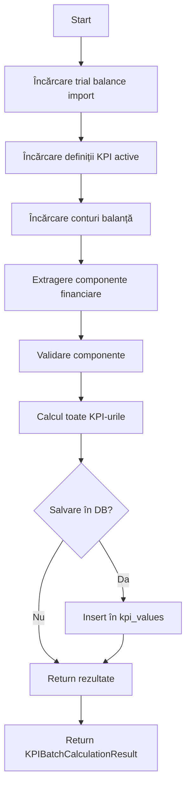

# KPI Calculation Engine - Documentație Completă

> **Task 1.7** - KPI Calculation Engine pentru FinGuard  
> Calculează 25+ indicatori financiari esențiali din balanțele de verificare

---

## 📋 Cuprins

1. [Overview](#overview)
2. [Arhitectură](#arhitectură)
3. [Instalare și Setup](#instalare-și-setup)
4. [Usage Examples](#usage-examples)
5. [KPI-uri Disponibile](#kpi-uri-disponibile)
6. [API Reference](#api-reference)
7. [Mapare Conturi OMFP 1802/2014](#mapare-conturi-omfp-18022014)
8. [Troubleshooting](#troubleshooting)

---

## Overview

**KPI Calculation Engine** este modulul care calculează automat indicatori financiari (KPIs) din balanțele de verificare procesate. Engine-ul:

✅ Extrage componente financiare din balanță (active, pasive, venituri, cheltuieli)  
✅ Calculează 25+ KPI-uri conform definițiilor din database  
✅ Suportă formule JSONB flexibile cu calcule intermediare  
✅ Validează rezultatele și detectează anomalii  
✅ Salvează automat în database cu metadata completă  
✅ Oferă interpretări intuitive (excelent/bun/slab)

---

## Arhitectură

Engine-ul este structurat în **3 module principale**:

```
lib/processing/
├── financial-extractor.ts   → Extragere componente financiare din balanță
├── kpi-calculator.ts         → Calcul KPI individual cu parsare formule
├── kpi-engine.ts             → Orchestrator principal (entry point)
└── index.ts                  → Export centralizat
```

### 1. **Financial Extractor** (`financial-extractor.ts`)

**Responsabilitate:** Mapează conturile din balanță pe componente financiare.

```typescript
extractFinancialComponents(accounts: TrialBalanceAccount[]): FinancialComponents
```

**Mapare conform OMFP 1802/2014:**
- **Clasa 1** → Capitaluri Proprii (Equity)
- **Clasa 2** → Active Imobilizate (Fixed Assets)
- **Clasa 3** → Stocuri (Inventory)
- **Clasa 4** → Creanțe și Datorii (Receivables & Payables)
- **Clasa 5** → Trezorerie (Cash & Equivalents)
- **Clasa 6** → Cheltuieli (Expenses)
- **Clasa 7** → Venituri (Revenue)

**Output:** Obiect `FinancialComponents` cu 30+ proprietăți agregate.

---

### 2. **KPI Calculator** (`kpi-calculator.ts`)

**Responsabilitate:** Calculează un KPI individual pe baza formulei JSONB.

```typescript
calculateKPI(definition: KPIDefinition, components: FinancialComponents): KPICalculationResult
```

**Features:**
- Parsare formule JSONB complexe
- Suport pentru calcule intermediare (ex: `nopat`, `revenue_per_day`)
- Evaluare securizată (fără `eval()`, folosește `Function` constructor)
- Detectare diviziune la zero și valori invalide
- Metadata detaliate pentru audit

---

### 3. **KPI Engine** (`kpi-engine.ts`) - **ENTRY POINT PRINCIPAL**

**Responsabilitate:** Orchestrează calculul complet al tuturor KPI-urilor.

```typescript
calculateAllKPIs(
  importId: string, 
  companyId: string, 
  options?: KPICalculationOptions
): Promise<KPIBatchCalculationResult>
```

**Flow complet:**



---

## Instalare și Setup

### Prerequisites

1. **Database setup complet** (Task 0.2) - tabelele `kpi_definitions` și `kpi_values` trebuie să existe
2. **Seed data KPI** încărcat - 25+ definiții KPI din `database/seed/kpi_definitions.sql`
3. **Trial Balance import completat** (Task 1.4) - conturi în `trial_balance_accounts`

### Verificare Setup

```typescript
// Verifică că definițiile KPI sunt încărcate
import { createServerClient } from '@/lib/supabase/server';

const supabase = await createServerClient();
const { data: kpis } = await supabase
  .from('kpi_definitions')
  .select('code, name, category')
  .eq('is_active', true);

console.log(`KPIs disponibili: ${kpis?.length}`);
// Expected: 25+ KPIs
```

---

## Usage Examples

### 1. **Calcul simplu - toate KPI-urile**

```typescript
import { calculateAllKPIs } from '@/lib/processing';

// După ce ai un trial balance import completat
const result = await calculateAllKPIs(importId, companyId);

console.log(`✅ Calculate ${result.statistics.successfulCalculations} KPIs`);
console.log(`❌ Failed ${result.statistics.failedCalculations} KPIs`);
console.log(`⏱️ Duration: ${result.statistics.duration}ms`);

// Accesare rezultate
result.results.forEach(kpi => {
  if (kpi.value !== null) {
    console.log(`${kpi.kpi_code}: ${kpi.value}`);
  }
});
```

---

### 2. **Calcul doar anumite categorii**

```typescript
import { calculateAllKPIs } from '@/lib/processing';

// Calculează doar KPI-uri de lichiditate și profitabilitate
const result = await calculateAllKPIs(importId, companyId, {
  categories: ['liquidity', 'profitability'],
  debug: true, // Log detaliat în console
});

// Filtrare rezultate după categorie
const liquidityKPIs = result.results.filter(r => 
  r.kpi_code.startsWith('current_') || r.kpi_code.startsWith('quick_')
);
```

---

### 3. **Re-calcul cu suprascrierea valorilor existente**

```typescript
import { calculateAllKPIs } from '@/lib/processing';

// Utile când s-au corectat date în balanță
const result = await calculateAllKPIs(importId, companyId, {
  overwriteExisting: true, // Șterge și re-calculează
  includeMetadata: true,   // Salvează metadata completă
  debug: true,
});
```

---

### 4. **Încărcare KPI-uri calculate**

```typescript
import { getCalculatedKPIs } from '@/lib/processing';

// Încarcă toate KPI-urile pentru o perioadă
const kpis = await getCalculatedKPIs(
  companyId,
  '2024-01-01',
  '2024-12-31'
);

// Filtrare după categorie
const profitabilityKPIs = await getCalculatedKPIs(
  companyId,
  '2024-01-01',
  '2024-12-31',
  ['profitability']
);
```

---

### 5. **Summary agregat**

```typescript
import { getKPISummary } from '@/lib/processing';

const summary = await getKPISummary(
  companyId,
  '2024-01-01',
  '2024-12-31'
);

console.log(`Total KPIs: ${summary.total}`);
console.log('By Category:', summary.byCategory);

// Output:
// {
//   liquidity: [
//     { code: 'current_ratio', name: 'Rata Lichidității Curente', value: 1.85, unit: 'ratio' },
//     { code: 'quick_ratio', name: 'Rata Lichidității Acide', value: 1.20, unit: 'ratio' }
//   ],
//   profitability: [...],
//   ...
// }
```

---

### 6. **Extragere manuală componente financiare**

```typescript
import { extractFinancialComponents, formatFinancialComponentsSummary } from '@/lib/processing';

// Presupunem că ai deja accounts din trial balance
const components = extractFinancialComponents(accounts);

console.log(`Total Active: ${components.total_assets} RON`);
console.log(`Profit Net: ${components.net_income} RON`);
console.log(`Lichiditate (current_assets / current_liabilities): ${
  components.current_assets / components.current_liabilities
}`);

// Print summary formatat
console.log(formatFinancialComponentsSummary(components));
```

---

### 7. **Calcul KPI individual (low-level API)**

```typescript
import { calculateKPI } from '@/lib/processing';

// Încarcă o definiție KPI
const { data: def } = await supabase
  .from('kpi_definitions')
  .select('*')
  .eq('code', 'current_ratio')
  .single();

const kpiDefinition = {
  ...def,
  parsedFormula: def.formula as KPIFormula
};

// Calculează
const result = calculateKPI(kpiDefinition, financialComponents, true);

console.log(`${result.kpi_code}: ${result.value}`);
console.log('Metadata:', result.metadata);
```

---

## KPI-uri Disponibile

### 📊 Lichiditate (Liquidity)

| Cod | Nume | Formula | Unit | Target |
|-----|------|---------|------|--------|
| `current_ratio` | Rata Lichidității Curente | `current_assets / current_liabilities` | ratio | > 1.5 |
| `quick_ratio` | Rata Lichidității Acide | `(current_assets - inventory) / current_liabilities` | ratio | > 1.0 |
| `cash_ratio` | Rata Lichidității Imediate | `cash / current_liabilities` | ratio | 0.2-0.5 |
| `working_capital` | Capital de Lucru | `current_assets - current_liabilities` | RON | > 0 |

---

### 💰 Profitabilitate (Profitability)

| Cod | Nume | Formula | Unit | Target |
|-----|------|---------|------|--------|
| `gross_margin` | Marja Brută | `((revenue - cogs) / revenue) * 100` | % | 20-50% |
| `operating_margin` | Marja Operațională | `(operating_income / revenue) * 100` | % | 10-20% |
| `net_margin` | Marja Netă | `(net_income / revenue) * 100` | % | 5-20% |
| `roa` | Return on Assets | `(net_income / avg_assets) * 100` | % | 5-20% |
| `roe` | Return on Equity | `(net_income / avg_equity) * 100` | % | 15-25% |
| `roic` | Return on Invested Capital | `(nopat / invested_capital) * 100` | % | > 10% |
| `ebitda_margin` | Marja EBITDA | `(ebitda / revenue) * 100` | % | 10-30% |

---

### 📈 Îndatorare (Leverage)

| Cod | Nume | Formula | Unit | Target |
|-----|------|---------|------|--------|
| `debt_to_equity` | Debt-to-Equity Ratio | `total_liabilities / equity` | ratio | < 1.0 |
| `debt_ratio` | Debt Ratio | `(total_liabilities / total_assets) * 100` | % | 30-60% |
| `equity_ratio` | Equity Ratio | `(equity / total_assets) * 100` | % | 40-70% |
| `interest_coverage` | Interest Coverage | `operating_income / interest_expense` | times | > 3.0 |
| `solvency_ratio` | Solvency Ratio | `((net_income + depreciation) / total_liabilities) * 100` | % | > 20% |

---

### ⚙️ Eficiență (Efficiency)

| Cod | Nume | Formula | Unit | Target |
|-----|------|---------|------|--------|
| `asset_turnover` | Asset Turnover | `revenue / avg_total_assets` | times | 0.5-2.0 |
| `inventory_turnover` | Inventory Turnover | `cogs / avg_inventory` | times | 5-10 |
| `days_sales_outstanding` | DSO | `(avg_receivables / (revenue/365))` | days | 30-60 |
| `days_payable_outstanding` | DPO | `(avg_payables / (cogs/365))` | days | 45-90 |
| `cash_conversion_cycle` | CCC | `DIO + DSO - DPO` | days | < 90 |
| `fixed_asset_turnover` | Fixed Asset Turnover | `revenue / avg_fixed_assets` | times | 2-6 |
| `receivables_turnover` | Receivables Turnover | `revenue / avg_receivables` | times | 6-12 |

---

### 📊 Creștere & Altele (Growth & Other)

| Cod | Nume | Formula | Unit |
|-----|------|---------|------|
| `revenue_growth` | Revenue Growth | `((current_rev - prev_rev) / prev_rev) * 100` | % |
| `profit_growth` | Profit Growth | `((current_profit - prev_profit) / prev_profit) * 100` | % |
| `asset_growth` | Asset Growth | `((current_assets - prev_assets) / prev_assets) * 100` | % |
| `productivity_per_employee` | Productivitate/Angajat | `revenue / employees` | RON |
| `profit_per_employee` | Profit/Angajat | `net_income / employees` | RON |
| `tax_burden` | Tax Burden | `(total_taxes / revenue) * 100` | % |

---

## API Reference

### `calculateAllKPIs()`

**Funcția principală pentru calculul tuturor KPI-urilor.**

```typescript
function calculateAllKPIs(
  importId: string,
  companyId: string,
  options?: KPICalculationOptions
): Promise<KPIBatchCalculationResult>
```

**Parametri:**
- `importId` - UUID al import-ului de trial balance (status = 'completed')
- `companyId` - UUID al companiei
- `options` - Opțiuni opționale:
  - `saveToDB?: boolean` - Salvează în DB (default: true)
  - `overwriteExisting?: boolean` - Suprascrie valori existente (default: false)
  - `categories?: KPICategory[]` - Filtrare categorii (ex: `['liquidity', 'profitability']`)
  - `kpiCodes?: string[]` - Filtrare coduri specifice (ex: `['current_ratio', 'roe']`)
  - `includeMetadata?: boolean` - Include metadata în DB (default: true)
  - `debug?: boolean` - Log detaliat (default: false)

**Returns:** `Promise<KPIBatchCalculationResult>` cu:
- `trial_balance_import_id` - ID import
- `company_id` - ID companie
- `period_start` / `period_end` - Perioada
- `results: KPICalculationResult[]` - Array cu rezultate individuale
- `financialComponents` - Componentele extrase
- `statistics` - Statistici (total, succese, eșecuri, durată)

**Throws:** Eroare dacă:
- Import-ul nu există sau nu e în status 'completed'
- Nu există definiții KPI active
- Nu există conturi în balanță
- Erori de DB

---

### `getCalculatedKPIs()`

**Încarcă KPI-uri deja calculate din database.**

```typescript
function getCalculatedKPIs(
  companyId: string,
  periodStart: string,
  periodEnd: string,
  categories?: string[]
): Promise<KPIValue[]>
```

---

### `recalculateKPIs()`

**Re-calculează toate KPI-urile pentru un import (șterge și recalculează).**

```typescript
function recalculateKPIs(
  importId: string,
  companyId: string,
  options?: KPICalculationOptions
): Promise<KPIBatchCalculationResult>
```

---

### `extractFinancialComponents()`

**Extrage componente financiare din conturi.**

```typescript
function extractFinancialComponents(
  accounts: TrialBalanceAccount[]
): FinancialComponents
```

**Returns:** Obiect cu 30+ proprietăți:
- Active: `total_assets`, `current_assets`, `fixed_assets`, `inventory`, `cash_and_equivalents`, `accounts_receivable`
- Pasive: `total_liabilities`, `current_liabilities`, `accounts_payable`, `shareholders_equity`
- P&L: `revenue`, `cogs`, `operating_expenses`, `operating_income`, `net_income`
- Medii: `average_total_assets`, `average_inventory`, etc.

---

### `calculateKPI()`

**Calculează un singur KPI (low-level API).**

```typescript
function calculateKPI(
  definition: KPIDefinition,
  components: FinancialComponents,
  debug?: boolean
): KPICalculationResult
```

---

## Mapare Conturi OMFP 1802/2014

### Structura Planului de Conturi

| Clasa | Nume | Mapare în Engine |
|-------|------|------------------|
| **1** | Capital și Rezerve | → `shareholders_equity` |
| **2** | Active Imobilizate | → `fixed_assets` |
| **3** | Stocuri și Producție | → `inventory` |
| **4** | Terți | → `accounts_receivable` (411), `accounts_payable` (401), `current_assets/liabilities` (altele) |
| **5** | Conturi de Trezorerie | → `cash_and_equivalents` |
| **6** | Cheltuieli | → `cogs` (60x), `interest_expense` (666), `depreciation` (681), `operating_expenses` (altele) |
| **7** | Venituri | → `revenue`, `sales_revenue` (707) |
| **8** | Conturi Speciale | → Ignorat (în afara bilanțului) |

### Exemple Concrete

```typescript
// Cont 401 (Furnizori) → Datorie
if (accountCode.startsWith('401')) {
  components.accounts_payable += Math.abs(closingBalance);
  components.current_liabilities += Math.abs(closingBalance);
}

// Cont 411 (Clienți) → Creanță
if (accountCode.startsWith('411')) {
  components.accounts_receivable += Math.abs(closingBalance);
  components.current_assets += Math.abs(closingBalance);
}

// Cont 512 (Bănci) → Cash
if (accountClass === '5') {
  components.cash_and_equivalents += Math.abs(closingBalance);
}

// Cont 707 (Vânzări mărfuri) → Revenue
if (accountCode.startsWith('707')) {
  components.sales_revenue += revenueAmount;
  components.revenue += revenueAmount;
}
```

---

## Troubleshooting

### ❌ "Import nu a fost găsit"

**Cauză:** `importId` invalid sau import șters.

**Soluție:**
```typescript
// Verifică că import-ul există
const { data: imports } = await supabase
  .from('trial_balance_imports')
  .select('id, status')
  .eq('company_id', companyId)
  .eq('status', 'completed');

console.log('Imports disponibile:', imports);
```

---

### ❌ "Import-ul trebuie să fie în status 'completed'"

**Cauză:** Import în status `pending`, `processing`, sau `failed`.

**Soluție:** Așteaptă finalizarea procesării trial balance (Task 1.4) sau re-procesează:
```typescript
import { processTrialBalance } from '@/lib/processing';

const result = await processTrialBalance(file, {
  companyId,
  periodStart: new Date('2024-01-01'),
  periodEnd: new Date('2024-12-31'),
});

// Apoi calculează KPI-uri
await calculateAllKPIs(result.importId, companyId);
```

---

### ❌ "Nu au fost găsite definiții KPI active"

**Cauză:** Seed data nu a fost încărcat în `kpi_definitions`.

**Soluție:**
```sql
-- Rulează seed data
\i database/seed/kpi_definitions.sql

-- Verifică
SELECT COUNT(*) FROM kpi_definitions WHERE is_active = true;
-- Expect: 25+
```

---

### ⚠️ "Diviziune la zero" sau valori NaN

**Cauză:** Componente financiare lipsă (ex: `current_liabilities = 0`).

**Soluție:**
- Verifică că balanța e completă (toate clasele de conturi prezente)
- Folosește `validateFinancialComponents()` pentru diagnostic:

```typescript
import { validateFinancialComponents } from '@/lib/processing';

const warnings = validateFinancialComponents(components);
warnings.forEach(w => console.warn(w));
```

---

### ⚠️ Valori KPI suspecte (ex: 1000000%)

**Cauză:** Erori în agregarea conturilor sau solduri inversate.

**Soluție:**
- Activează `debug: true` pentru a vedea componente intermediate
- Verifică soldurile manual în trial balance
- Folosește `formatFinancialComponentsSummary()` pentru inspecție

```typescript
const result = await calculateAllKPIs(importId, companyId, { debug: true });
console.log(formatFinancialComponentsSummary(result.financialComponents));
```

---

### 🐛 Debugging Avansat

**Enable logging complet:**

```typescript
const result = await calculateAllKPIs(importId, companyId, {
  debug: true,           // Log toate pașii
  includeMetadata: true, // Salvează metadata completă
  saveToDB: false,       // Nu salva (doar testing)
});

// Inspectează fiecare KPI
result.results.forEach(kpi => {
  console.log(`\n=== ${kpi.kpi_code} ===`);
  console.log('Value:', kpi.value);
  console.log('Formula:', kpi.metadata.formulaUsed);
  console.log('Components:', kpi.metadata.components);
  if (kpi.metadata.warnings) {
    console.log('Warnings:', kpi.metadata.warnings);
  }
});
```

---

## Performance Notes

- **Calcul complet (25 KPI-uri):** ~200-500ms pentru 500 conturi
- **Extragere componente:** ~50-100ms
- **Calcul individual KPI:** ~5-10ms
- **Salvare în DB (batch insert):** ~50-150ms

**Optimizări:**
- Folosește `categories` filter pentru a calcula doar KPI-uri necesare
- Cache-uiește rezultatele în frontend (validitate: până la re-import balanță)
- Consideră background job pentru volume mari (Task 2.1)

---

## Next Steps

După completarea Task 1.7, continuă cu:

- **Task 1.8:** KPI Dashboard UI - Vizualizare KPI-uri cu charts
- **Task 1.9:** Financial Statements Generation
- **Task 2.2:** Comparative Analysis - Trend KPI-uri între perioade

---

## Support

Pentru bug reports sau feature requests:
- Issues: GitHub repository
- Documentație: `/app-guidelines/plan.md`
- Code: `/lib/processing/kpi-engine.ts`

**Made with ❤️ for FinGuard**
